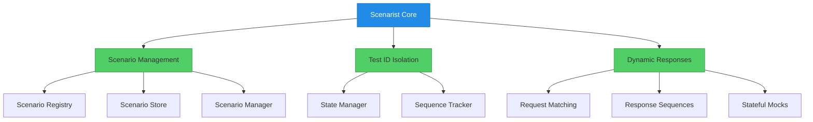
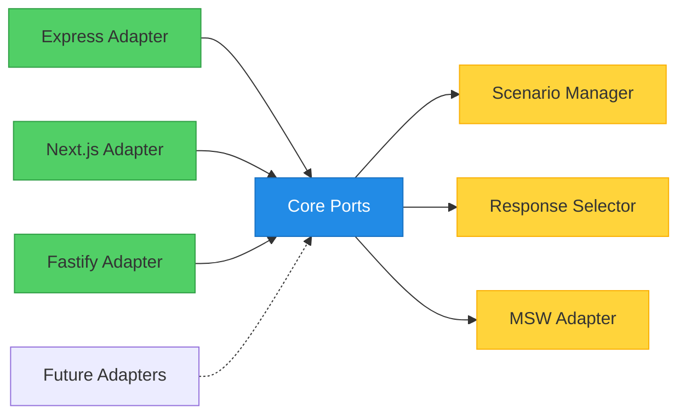
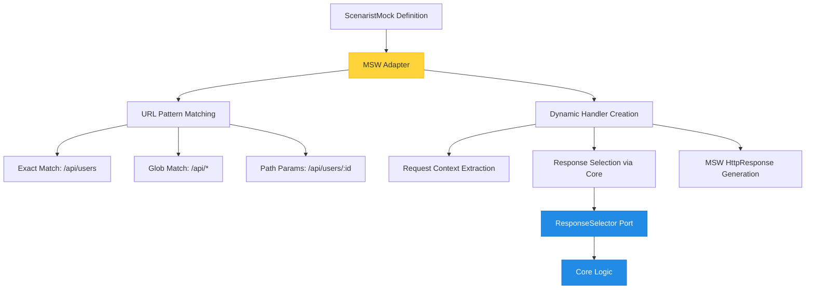
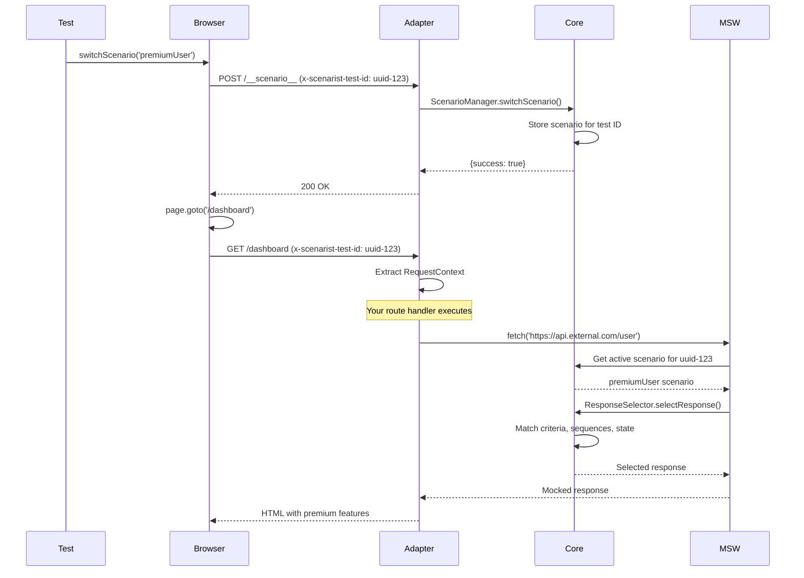

Scenarist uses **hexagonal architecture** (also called ports and adapters) to maintain complete framework independence. This means the core scenario management logic has zero framework dependencies, while thin adapters integrate with Express, Next.js, Fastify, and other frameworks.

## Why This Architecture Matters

**The Testing Gap Scenarist Fills:**

Unit tests CAN test server-side logic, but require extensive code-level mocking (request/response objects, session state, auth context, middleware chains, database connections). These mocks create distance from production—bugs can hide in the gap between mocked and real execution.

Browser tests give production-like execution, but testing multiple scenarios requires either complex per-scenario mocking, server restarts (impractical in CI), or hitting real external APIs (slow, flaky, expensive). Result: browser tests typically cover only the happy path.

**What developers actually need:** Test backend logic (API routes, validation, middleware, business rules, Server Components) through real HTTP requests with multiple scenarios—without external API dependencies and without server restarts.

**How Scenarist's architecture solves this:**
- **Framework-agnostic core** handles scenario switching, test isolation, and response selection
- **Thin adapters** integrate with any framework (Express, Next.js, Remix, etc.)
- **Your entire backend executes normally** (middleware chains, validation, business logic, Server Components)
- **Only external APIs are mocked** (Stripe, SendGrid, Auth0, etc.)

This architecture ensures your code runs in production-like conditions (real middleware, real auth, real routing) while still enabling comprehensive scenario testing.

## The Hexagon: Framework-Agnostic Core

The internal core package contains all domain logic with **zero dependencies** on any web framework. Users interact with this through adapters - the core is not installed directly:



### Core Responsibilities

**1. Scenario Management**
- `ScenarioRegistry`: Stores scenario definitions (in-memory or external)
- `ScenarioStore`: Tracks active scenario per test ID
- `ScenarioManager`: Coordinates registration, switching, and retrieval

**2. Test ID Isolation**
- `StateManager`: Manages captured state per test ID
- `SequenceTracker`: Tracks sequence positions per test ID
- Each test gets isolated state via unique test ID header

**3. Dynamic Responses**
- `ResponseSelector`: Selects responses based on request content matching
- Sequence management: Advances position, handles repeat modes
- State capture/injection: Template replacement with `{{state.key}}` syntax

### Ports: Behavior Contracts

The core defines **interfaces** (ports) that adapters must implement:

```typescript
// Driving ports (called BY core)
interface ScenarioManager {
  registerScenario(definition: ScenaristScenario): void;
  switchScenario(testId: string, scenarioId: string): ScenaristResult<void>;
  getActiveScenario(testId: string): ActiveScenario | undefined;
  listScenarios(): ReadonlyArray<ScenaristScenario>;
}

// Driven ports (called by adapters)
interface RequestContext {
  getTestId(): string;
  getBody(): unknown;
  getHeaders(): Record<string, string>;
  getQuery(): Record<string, string>;
}

interface ScenarioRegistry {
  register(definition: ScenaristScenario): void;
  get(scenarioId: string): ScenaristScenario | undefined;
  list(): ReadonlyArray<ScenaristScenario>;
}

interface ScenarioStore {
  set(testId: string, scenario: ActiveScenario): void;
  get(testId: string): ActiveScenario | undefined;
  delete(testId: string): void;
}
```

**Why interfaces for ports?**
- Signal implementation contracts clearly
- Better TypeScript errors when implementing
- Conventional in hexagonal architecture
- Class-friendly for adapter implementations
- (See "Why types for data?" below for complementary rationale)

### Data Types: Immutable Structures

All data structures use `type` (not `interface`) with `readonly`:

```typescript
type ScenaristScenario = {
  readonly id: string;
  readonly name: string;
  readonly description?: string;
  readonly mocks: ReadonlyArray<ScenaristMock>;
};

type ScenaristMock = {
  readonly method: 'GET' | 'POST' | 'PUT' | 'DELETE' | 'PATCH';
  readonly url: string;
  readonly response?: MockResponse;
  readonly sequence?: ResponseSequence;
  readonly match?: MatchCriteria;
  readonly captureState?: Record<string, StateCapture>;
};
```

**Why types for data?**
- Emphasizes immutability
- Better for unions, intersections, mapped types
- Functional programming alignment
- Prevents accidental mutations

## Framework Adapters: Thin Integration Layers

Adapters are small (~100 lines) framework-specific integration layers. They translate between framework concepts and core ports.



### Adapter Responsibilities

Each adapter does **three things only**:

**1. Extract Request Context (Framework-Specific)**

```typescript
// Express
class ExpressRequestContext implements RequestContext {
  constructor(private req: Request) {}

  getTestId(): string {
    return this.req.headers['x-scenarist-test-id'] as string || 'default-test';
  }

  getBody(): unknown {
    return this.req.body;
  }

  getHeaders(): Record<string, string> {
    return this.req.headers as Record<string, string>;
  }
}

// Next.js App Router
class NextAppRequestContext implements RequestContext {
  constructor(private request: Request) {}

  getTestId(): string {
    return this.request.headers.get('x-scenarist-test-id') || 'default-test';
  }

  getBody(): unknown {
    // Must be parsed before constructing context
    return this.parsedBody;
  }
}
```

**2. Wire Up Scenario Endpoints (Framework-Specific)**

```typescript
// Express
app.post('/__scenario__', async (req, res) => {
  const testId = extractTestId(req);
  const { scenario } = req.body;

  const result = scenarist.scenarioManager.switchScenario(testId, scenario);

  if (result.success) {
    res.json({ success: true });
  } else {
    res.status(404).json({ success: false, error: result.error.message });
  }
});

// Next.js App Router
export async function POST(request: Request) {
  const testId = request.headers.get('x-scenarist-test-id') || 'default-test';
  const { scenario } = await request.json();

  const result = scenarist.scenarioManager.switchScenario(testId, scenario);

  return Response.json(
    result.success
      ? { success: true }
      : { success: false, error: result.error.message },
    { status: result.success ? 200 : 404 }
  );
}
```

**3. Delegate Everything Else to Core**

All scenario management, response selection, state tracking, and sequence advancement happens in the framework-agnostic core. Adapters are **translation layers only**.

### Why Adapters Stay Thin

**Adapter anti-patterns (avoided):**
- ❌ Duplicating scenario management logic
- ❌ Implementing response selection
- ❌ Managing test ID isolation
- ❌ Handling state capture/injection

**Correct adapter pattern:**
- ✅ Extract request context (framework-specific)
- ✅ Create endpoint routes (framework-specific)
- ✅ Delegate to core for all logic (framework-agnostic)

## MSW Integration Layer

The MSW adapter (`@scenarist/msw-adapter`) converts framework-agnostic scenario definitions into MSW handlers:



### MSW Adapter Responsibilities

**1. Convert Mock Definitions to MSW Handlers**

```typescript
const mockDefinition: ScenaristMock = {
  method: 'GET',
  url: '/api/users/:id',
  response: {
    status: 200,
    body: { name: 'John Doe' }
  }
};

// MSW Adapter converts to:
http.get('/api/users/:id', async ({ request }) => {
  // Extract context, select response via core, return HttpResponse
  return HttpResponse.json({ name: 'John Doe' }, { status: 200 });
});
```

**2. URL Pattern Matching**

- **Exact match**: `/api/users` (string literal)
- **Glob patterns**: `/api/*` or `/api/users/*`
- **Path parameters**: `/api/users/:id` (extracted and available in context)

**3. Dynamic Handler with Fallback**

For each HTTP request:
1. Extract test ID from request headers
2. Get active scenario for test ID from core
3. If scenario exists, use scenario mocks
4. If no scenario, fall back to default scenario
5. Delegate response selection to core's `ResponseSelector`

### Why MSW Integration is Separate

The MSW adapter is **not part of core** because:
- MSW is a framework for mocking HTTP (runtime dependency)
- Core must remain dependency-free (pure TypeScript)
- MSW adapter can be swapped for alternatives (Mirage, Nock, etc.)

## Data Flow: Request to Response

Here's how a request flows through Scenarist:



### Step-by-Step Breakdown

**1. Scenario Switching**
- Test calls `switchScenario(page, 'premiumUser')`
- Playwright helper sends POST to `/__scenario__`
- Adapter extracts test ID, calls core's `ScenarioManager`
- Core stores `{ testId: 'uuid-123', scenarioId: 'premiumUser' }`

**2. Page Navigation**
- Browser navigates to `/dashboard` with `x-scenarist-test-id: uuid-123` header
- Adapter extracts `RequestContext` from framework request
- **Your route handler/Server Component executes normally**

**3. External API Call**
- Your code calls `fetch('https://api.external.com/user')`
- MSW intercepts the external call
- MSW asks core for active scenario: `uuid-123` → `premiumUser`
- MSW delegates response selection to core's `ResponseSelector`

**4. Response Selection**
- Core checks match criteria (body, headers, query params)
- Core advances sequences if applicable
- Core injects state via templates if applicable
- Core returns selected response to MSW
- MSW returns response to your code

**5. Your Code Continues**
- Your route handler receives mocked response
- Your business logic executes with mocked data
- Your Server Component renders with real logic
- HTML sent to browser

## Dependency Injection Pattern

The core uses **dependency injection** for all port implementations:

```typescript
// ❌ WRONG - Creating implementation internally
export const createScenarioManager = () => {
  const registry = new Map<string, ScenaristScenario>();  // Hardcoded!
  // ...
};

// ✅ CORRECT - Injecting ports
export const createScenarioManager = ({
  registry,  // Injected
  store,     // Injected
}: {
  registry: ScenarioRegistry;
  store: ScenarioStore;
}): ScenarioManager => {
  return {
    registerScenario(definition) {
      registry.register(definition);  // Delegate to injected port
    },
    // ...
  };
};
```

**Why dependency injection matters:**
- ✅ Enables any port implementation (in-memory, Redis, files, remote)
- ✅ Testable (inject mocks for testing)
- ✅ True hexagonal architecture
- ✅ Follows dependency inversion principle

### Default Implementations

The core provides default in-memory implementations. Note: This is internal implementation detail - users interact through adapters, not directly with core:

```typescript
// Internal implementation (adapters use this, users don't import directly)
import {
  createScenarioManager,
  InMemoryScenarioRegistry,
  InMemoryScenarioStore,
  InMemoryStateManager,
  InMemorySequenceTracker,
} from '@scenarist/core';  // Internal package

const registry = new InMemoryScenarioRegistry();
const store = new InMemoryScenarioStore();
const stateManager = new InMemoryStateManager();
const sequenceTracker = new InMemorySequenceTracker();

const scenarioManager = createScenarioManager({
  registry,
  store,
  stateManager,
  sequenceTracker,
});
```

### Alternative Implementations

Because ports are injected, you can swap implementations:

```typescript
// Redis-backed scenario store for distributed testing
class RedisScenarioStore implements ScenarioStore {
  constructor(private client: RedisClient) {}

  set(testId: string, scenario: ActiveScenario): void {
    this.client.set(`scenario:${testId}`, JSON.stringify(scenario));
  }

  get(testId: string): ActiveScenario | undefined {
    const data = this.client.get(`scenario:${testId}`);
    return data ? JSON.parse(data) : undefined;
  }
}

const store = new RedisScenarioStore(redisClient);
const scenarioManager = createScenarioManager({ registry, store });
```

## Serialization: Why Scenarios Are Plain Objects

All scenario definitions are **JSON-serializable** (no functions, regex, or closures):

```typescript
// ✅ SERIALIZABLE - Pure data
type ScenaristMock = {
  readonly method: 'GET' | 'POST';
  readonly url: string;  // String, not RegExp
  readonly response: {
    readonly status: number;
    readonly body?: unknown;  // JSON-serializable
  };
};

// ❌ NOT SERIALIZABLE - Contains functions
type MSWHandler = HttpHandler;  // Has functions, closures, regex
```

**Why serialization matters:**

Without serialization, port interfaces can only have in-memory implementations, severely limiting their utility:

- ❌ `RedisScenarioRegistry` - Impossible (can't serialize functions)
- ❌ `FileSystemScenarioRegistry` - Impossible (can't JSON.stringify regex)
- ❌ `RemoteScenarioRegistry` - Impossible (can't send closures over HTTP)

With serialization, multiple implementations become possible:

- ✅ `InMemoryScenarioRegistry` - Fast, single process
- ✅ `RedisScenarioRegistry` - Distributed testing across processes
- ✅ `FileSystemScenarioRegistry` - Version control scenarios as JSON/YAML
- ✅ `RemoteScenarioRegistry` - Fetch scenarios from REST API
- ✅ `DatabaseScenarioRegistry` - Store in PostgreSQL/MongoDB

**Runtime conversion:** MSW handlers are created at runtime from serializable definitions:

```typescript
const toMSWHandler = (mock: ScenaristMock): HttpHandler => {
  return http[mock.method.toLowerCase()](mock.url, async () => {
    if (mock.response.delay) await delay(mock.response.delay);
    return HttpResponse.json(mock.response.body, {
      status: mock.response.status,
      headers: mock.response.headers,
    });
  });
};
```

## Benefits of Hexagonal Architecture

**1. Framework Independence**
- Write scenarios once, use with Express, Next.js, Remix, Fastify
- Switching frameworks doesn't require rewriting tests
- Core improvements benefit all frameworks immediately

**2. Testability**
- Core has zero dependencies (easy to test)
- Adapters are thin (easy to test)
- Ports can be mocked for unit testing

**3. Extensibility**
- Add new frameworks by writing ~100 line adapter
- Add new storage backends by implementing ports
- Add new features in core, all adapters benefit

**4. Maintainability**
- Clear separation of concerns
- Framework-specific code isolated to adapters
- Domain logic centralized in core

## Next Steps

- [Understanding Scenarios](/concepts/scenarios) - How to define and structure scenarios
- [Dynamic Responses](/concepts/dynamic-responses) - Request matching, sequences, and state
- [Framework Guides](/frameworks/express/getting-started) - Integrating with your framework
