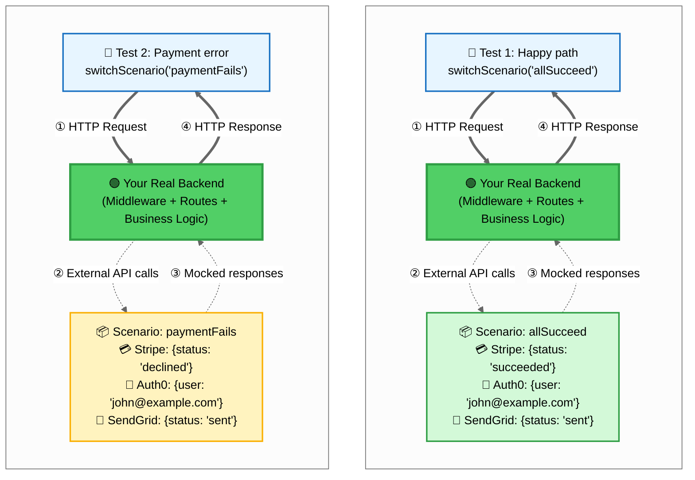
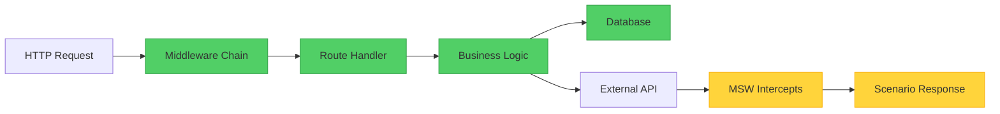
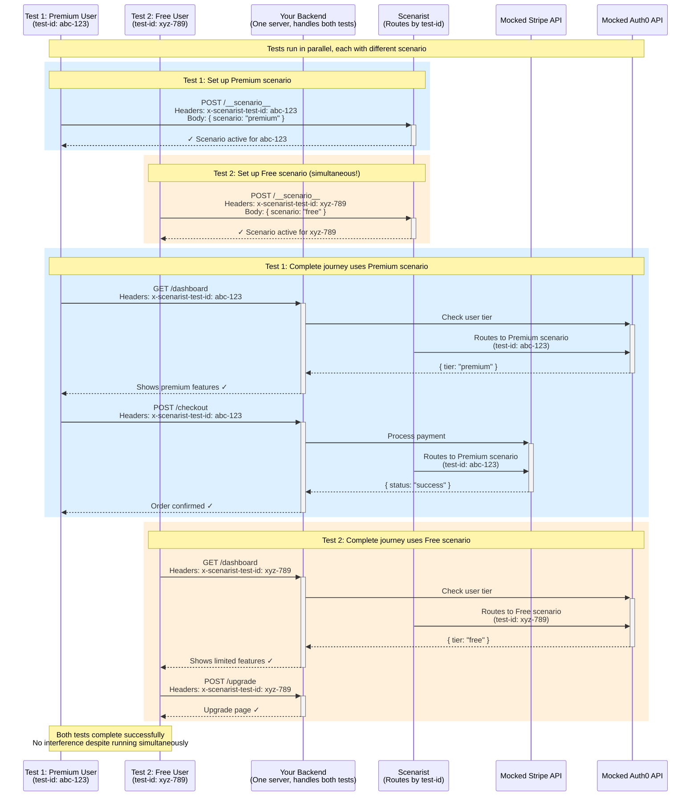

Scenarist fills the testing gap by enabling **HTTP-level integration testing** with **runtime scenario switching**:

- Tests make real HTTP requests to your backend
- Your backend code executes normally (middleware, routing, business logic)
- External API calls are intercepted and return scenario-defined responses
- Different scenarios run in parallel against the same server instance
- Each test is isolated via unique test identifiers

## One Server, Unlimited Scenarios



**The key insight:** Each scenario is a **complete set of API mocks** that defines how every external API behaves for that test. The diagram shows 2 scenarios as examples—you can define as many as you need, and each scenario can mock as many APIs as your application uses.

**Understanding the pattern:**

Each test switches to a specific scenario, and that scenario controls **all external API responses** for the duration of that test:

- **Test 1** switches to `allSucceed` → Stripe succeeds, Auth0 authenticates, SendGrid sends
- **Test 2** switches to `paymentFails` → Stripe declines, Auth0 authenticates, SendGrid sends

Notice how each scenario defines the complete behavior: in `paymentFails`, only Stripe fails—Auth0 and SendGrid still succeed. This lets you test **exactly** the edge case you care about.

**Default scenario pattern (recommended):**

Define a `default` scenario with your **happy path** responses for all external APIs. Then create specialized scenarios that override only what changes:

```typescript
import type { ScenaristScenarios } from "@scenarist/nextjs-adapter/app";

const scenarios = {
  default: {
    // Happy path - all APIs succeed
    mocks: [
      { url: "https://api.stripe.com/...", response: { status: "succeeded" } },
      {
        url: "https://api.auth0.com/...",
        response: { user: "john@example.com" },
      },
      { url: "https://api.sendgrid.com/...", response: { status: "sent" } },
    ],
  },
  paymentFails: {
    // Only override Stripe - Auth0 and SendGrid automatically fall back to default
    mocks: [
      { url: "https://api.stripe.com/...", response: { status: "declined" } },
    ],
  },
} as const satisfies ScenaristScenarios;
```

When you switch to `paymentFails`, Scenarist uses that scenario's mocks (Stripe declines) **and automatically falls back to the default scenario** for any APIs not defined (Auth0 and SendGrid succeed). This eliminates duplication—you only define what changes.

**What this enables:**

- ✅ **Unlimited scenarios** - Premium users, free users, error states, edge cases—as many as you need
- ✅ **Unlimited APIs per scenario** - Mock Stripe, Auth0, SendGrid, GitHub, Twilio—as many as your app uses
- ✅ **Default fallback** - Define happy path once, override only what changes in each scenario
- ✅ **Test edge cases exhaustively** - Can't make real Stripe decline with a specific error code, but your scenario can
- ✅ **Fast parallel testing** - All scenarios run simultaneously against the same server

## Execution Model

When testing with Scenarist, your backend executes as it would in production:



**Green boxes**: Your code executes with production behavior
**Yellow boxes**: External API calls are intercepted and handled by scenario definitions

## Example

This example demonstrates HTTP-level testing with Next.js. Each framework has its own adapter that integrates Scenarist into your application.

**Step 1: Framework-specific setup** (done once per application)

```typescript
// app/api/[[...route]]/route.ts - Next.js App Router
import { createScenarist } from "@scenarist/nextjs-adapter";
import { scenarios } from "./scenarios";

export const { GET, POST } = createScenarist({
  enabled: process.env.NODE_ENV === "test",
  scenarios,
});
```

**Step 2: Define scenarios** (reusable across tests)

```typescript
// scenarios.ts
import type { ScenaristScenarios } from "@scenarist/nextjs-adapter/app";

export const scenarios = {
  premiumUser: {
    id: "premiumUser",
    name: "Premium User",
    mocks: [
      {
        method: "GET",
        url: "https://api.auth-provider.com/session",
        response: {
          status: 200,
          body: { tier: "premium", userId: "user-123" },
        },
      },
    ],
  },
} as const satisfies ScenaristScenarios;
```

**Step 3: [Set up Playwright fixtures](/testing/playwright-integration)** (one-time setup)

```typescript
// tests/fixtures.ts
import { withScenarios, expect } from "@scenarist/playwright-helpers";
import { scenarios } from "./scenarios"; // Import your scenarios

// Create type-safe test object with scenario IDs
export const test = withScenarios(scenarios);
export { expect };
```

**Step 4: Write tests** (import from fixtures, not @playwright/test)

```typescript
// tests/premium-features.spec.ts
import { test, expect } from "./fixtures"; // ✅ Import from fixtures, NOT @playwright/test

test("premium users access advanced features", async ({
  page,
  switchScenario,
}) => {
  await switchScenario(page, "premiumUser"); // ✅ Type-safe! Autocomplete works

  // Real HTTP request → Next.js route → middleware → business logic
  await page.goto("/dashboard");

  // External auth API call intercepted, returns mocked premium tier
  // Your business logic processes the tier correctly
  await expect(page.getByText("Advanced Analytics")).toBeVisible();
});
```

**What's happening:**

1. Framework adapter integrates Scenarist into your Next.js app
2. Scenarios define how external APIs behave
3. [Playwright fixtures](/testing/playwright-integration) create type-safe test helpers with scenario autocomplete
4. Tests import from fixtures (not @playwright/test directly)
5. Test switches to scenario and makes real HTTP requests
6. Your backend code executes with production behavior
7. External API calls return scenario-defined responses

**See complete working examples:**

- [Next.js Example App →](/frameworks/nextjs-app-router/example-app)
- [Express Example App →](/frameworks/express/example-app)

**Framework-specific guides:**

- [Next.js setup →](/frameworks/nextjs-app-router/getting-started)
- [Express setup →](/frameworks/express/getting-started)

## Ephemeral Endpoints: Test-Only Activation

Scenarist creates special `/__scenario__` endpoints that **only exist when testing is enabled**. These ephemeral endpoints enable runtime scenario switching while maintaining production safety.

**What are ephemeral endpoints?**

- `POST /__scenario__` - Switch the active scenario for a test
- `GET /__scenario__` - Check which scenario is currently active

**Why "ephemeral"?**

The endpoints only exist when you set `enabled: true` in your Scenarist configuration:

```typescript
const scenarist = createScenarist({
  enabled: process.env.NODE_ENV === "test", // Only active in test environment
  scenarios,
});
```

**When `enabled: true` (test mode):**

- Endpoints accept requests and switch scenarios
- MSW intercepts external API calls
- Test ID headers route requests to correct scenarios

**When `enabled: false` (production):**

- Endpoints return 404 (do not exist)
- Zero overhead - no middleware, no MSW, no scenario infrastructure
- Your app runs exactly as it would without Scenarist

This ensures scenario switching infrastructure **never leaks into production**, even if you accidentally deploy with `enabled: true`.

[Learn more about ephemeral endpoints →](/reference/ephemeral-endpoints)

## Runtime Scenario Switching

Traditional end-to-end tests cannot switch external API behavior at runtime. Testing different scenarios (premium vs free users, error states) typically requires separate deployments, complex data setup, or conditional logic in application code.

Scenarist addresses this through runtime scenario switching using test identifiers:

```typescript
// Define multiple scenarios
const scenarios = {
  premium: {
    /* premium tier mocks */
  },
  free: {
    /* free tier mocks */
  },
  error: {
    /* error state mocks */
  },
} as const satisfies ScenaristScenarios;

// Tests run concurrently
test("premium features", async ({ page, switchScenario }) => {
  await switchScenario(page, "premium");
  // Test with premium scenario
});

test("free features", async ({ page, switchScenario }) => {
  await switchScenario(page, "free");
  // Test with free scenario - runs simultaneously
});
```

### How Test Isolation Works: Complete Request Flow

Here's how two tests run in parallel with different scenarios, showing the complete journey from scenario setup through multiple requests:



**The test isolation mechanism:**

1. **Each test gets a unique ID** (generated automatically)
2. **Test switches scenario once** via `POST /__scenario__` with its test ID
3. **All subsequent requests** include the test ID in headers (`x-scenarist-test-id: abc-123`)
4. **Scenarist routes based on test ID** - same URL, different responses per test
5. **Scenario persists** for the entire test journey (dashboard → checkout → confirmation)
6. **Tests run in parallel** - Test 1 and Test 2 execute simultaneously without affecting each other

This enables:

- ✅ **Unlimited scenarios** - Test premium, free, errors, edge cases all in parallel
- ✅ **No interference** - Each test isolated by unique test ID
- ✅ **One backend server** - All tests share same server instance
- ✅ **Real HTTP execution** - Your middleware, routing, and logic run normally
- ✅ **Fast execution** - No expensive external API calls

This enables parallel test execution without process coordination or port conflicts.

## Framework Independence

Scenarist uses hexagonal architecture to maintain framework independence. The core has no web framework dependencies.

Benefits:

- Scenario definitions work across all frameworks
- Framework-specific adapters handle integration
- Switching frameworks doesn't require rewriting scenarios

Supported frameworks: Express and Next.js (Pages and App Router). Additional adapters planned.

[Learn about the architecture →](/concepts/architecture)

## Next Steps

- [Dynamic Capabilities →](/concepts/dynamic-responses) - Request matching, sequences, stateful mocks
- [Scenario Format →](/concepts/scenario-format) - Complete scenario structure reference
- [Framework Guides →](/frameworks/express/getting-started) - Integrating with your framework
- [Architecture Details →](/concepts/architecture) - Deep dive into hexagonal architecture
