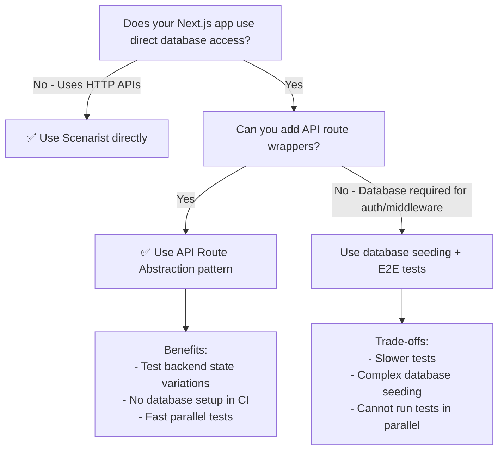

import { Aside } from '@astrojs/starlight/components';

Most production Next.js applications fetch data from databases (PostgreSQL, MongoDB, etc.) rather than external HTTP APIs. Since Scenarist intercepts HTTP requests via MSW, it cannot directly mock database calls. This guide shows you how to make database-heavy Next.js apps testable with Scenarist.

## The Problem

**Next.js apps with direct database access are not directly testable with Scenarist:**

```typescript
// ❌ Scenarist CANNOT mock this - no HTTP request
// app/lib/data.ts
import { db } from './db';

export async function fetchProducts() {
  return await db.products.findMany();
}

// app/products/page.tsx - Server Component
export default async function ProductsPage() {
  const products = await fetchProducts(); // Direct database call
  return <ProductList products={products} />;
}
```

**Why this doesn't work:**
- `db.products.findMany()` is a direct function call to the database driver
- No HTTP request is made
- MSW (which Scenarist uses) only intercepts `fetch()` calls
- Database connections use TCP sockets, not HTTP

<Aside type="caution">
Scenarist intercepts HTTP requests only. It cannot mock:
- Database calls (PostgreSQL, MongoDB, MySQL, etc.)
- File system operations (`fs.readFile`, `fs.writeFile`)
- WebSocket connections
- gRPC calls
- Direct function calls or imports
</Aside>

## The Solution: API Route Abstraction

**Add a thin HTTP layer between your Server Components and the database:**

### Step 1: Create an API Route Wrapper

```typescript
// app/api/products/route.ts
import { NextResponse } from 'next/server';
import { fetchProducts } from '@/lib/data'; // Still uses database

export async function GET(request: Request) {
  try {
    const products = await fetchProducts(); // Database call stays the same
    return NextResponse.json(products);
  } catch (error) {
    return NextResponse.json(
      { error: 'Failed to fetch products' },
      { status: 500 }
    );
  }
}
```

### Step 2: Update Server Components to Call the API Route

```typescript
// app/products/page.tsx - Server Component
import { scenarist } from '@/lib/scenarist';

export default async function ProductsPage() {
  // ✅ Now makes HTTP request that Scenarist can intercept
  const response = await fetch('http://localhost:3000/api/products', {
    headers: scenarist.getHeaders(request),
    cache: 'no-store', // Ensure fresh data
  });

  if (!response.ok) {
    throw new Error('Failed to fetch products');
  }

  const products = await response.json();
  return <ProductList products={products} />;
}
```

<Aside type="tip">
**Why `cache: 'no-store'`?**

Next.js aggressively caches `fetch()` responses by default. Adding `cache: 'no-store'` ensures each test gets fresh mock data without stale cache interference.
</Aside>

### Step 3: Mock the API Route with Scenarist

```typescript
// lib/scenarios.ts
export const defaultScenario: ScenaristScenario = {
  id: 'default',
  name: 'Happy Path Products',
  mocks: [
    {
      method: 'GET',
      url: 'http://localhost:3000/api/products',
      response: {
        status: 200,
        body: [
          { id: 1, name: 'Product A', price: 99.99 },
          { id: 2, name: 'Product B', price: 149.99 },
        ],
      },
    },
  ],
};

export const outOfStockScenario: ScenaristScenario = {
  id: 'outOfStock',
  name: 'Out of Stock Products',
  mocks: [
    {
      method: 'GET',
      url: 'http://localhost:3000/api/products',
      response: {
        status: 200,
        body: [
          { id: 1, name: 'Product A', price: 99.99, stock: 0 },
          { id: 2, name: 'Product B', price: 149.99, stock: 0 },
        ],
      },
    },
  ],
};
```

### Step 4: Write Playwright Tests

```typescript
// tests/products.spec.ts
import { test, expect } from '@playwright/test';
import { scenaristFixtures } from '@scenarist/playwright-helpers';

const { switchScenario } = scenaristFixtures({
  testIdHeader: 'x-test-id',
  scenarioEndpoint: 'http://localhost:3000/__scenario__',
});

test.use({ ...switchScenario });

test('should show products with stock', async ({ page, switchScenario }) => {
  await switchScenario(page, 'default');
  await page.goto('/products');

  await expect(page.getByText('Product A')).toBeVisible();
  await expect(page.getByText('Product B')).toBeVisible();
  await expect(page.getByText('£99.99')).toBeVisible();
});

test('should show out of stock message', async ({ page, switchScenario }) => {
  await switchScenario(page, 'outOfStock');
  await page.goto('/products');

  await expect(page.getByText('Out of Stock')).toBeVisible({ count: 2 });
});
```

## Decision Tree: When to Use This Pattern



### Use API Route Abstraction When:

- ✅ You want to test **different backend states** (success, errors, edge cases)
- ✅ You want **fast tests** without database setup
- ✅ You want to **run tests in parallel** with different data
- ✅ Your database calls are in **data fetching** logic (not authentication)
- ✅ You can add thin API wrappers without major refactoring

### Don't Use API Route Abstraction When:

- ❌ Database is required for **authentication/authorization** middleware
- ❌ You're testing **database-specific behavior** (transactions, constraints)
- ❌ Adding API routes would be a **major architectural change**
- ❌ You need to test **Server Actions** that mutate database state directly

<Aside type="note">
**Why not always use database seeding?**

Database seeding (setting up test data in a real database before each test) works but has downsides:
- Slow (need to wait for database connections and writes)
- Complex (need to clean up between tests)
- Serial (cannot run tests in parallel without database isolation)
- Brittle (schema changes break test data setup)

API route abstraction gives you the testing benefits of a real backend without the complexity and slowness of database management.
</Aside>

## Real-World Example: Next.js Learn Dashboard

The [Next.js Learn tutorial dashboard](https://github.com/vercel/next-learn/tree/main/dashboard/final-example) uses direct PostgreSQL access:

```typescript
// Original code - NOT testable with Scenarist
// app/lib/data.ts
import postgres from 'postgres';
const sql = postgres(process.env.POSTGRES_URL!);

export async function fetchRevenue() {
  const data = await sql<Revenue[]>`SELECT * FROM revenue`;
  return data;
}

// app/dashboard/(overview)/page.tsx
export default async function DashboardPage() {
  const revenue = await fetchRevenue(); // Direct database call
  return <RevenueChart data={revenue} />;
}
```

**To make this testable with Scenarist:**

```typescript
// Step 1: Add API route
// app/api/revenue/route.ts
import { fetchRevenue } from '@/lib/data';

export async function GET() {
  const revenue = await fetchRevenue(); // Still uses database internally
  return NextResponse.json(revenue);
}

// Step 2: Update Server Component
// app/dashboard/(overview)/page.tsx
import { scenarist } from '@/lib/scenarist';

export default async function DashboardPage() {
  const response = await fetch('http://localhost:3000/api/revenue', {
    headers: scenarist.getHeaders(request),
    cache: 'no-store',
  });
  const revenue = await response.json();
  return <RevenueChart data={revenue} />;
}

// Step 3: Mock the API route
// lib/scenarios.ts
export const highRevenueScenario: ScenaristScenario = {
  id: 'highRevenue',
  mocks: [{
    method: 'GET',
    url: 'http://localhost:3000/api/revenue',
    response: {
      status: 200,
      body: [
        { month: 'Jan', revenue: 50000 },
        { month: 'Feb', revenue: 75000 },
        { month: 'Mar', revenue: 100000 },
      ],
    },
  }],
};

export const lowRevenueScenario: ScenaristScenario = {
  id: 'lowRevenue',
  mocks: [{
    method: 'GET',
    url: 'http://localhost:3000/api/revenue',
    response: {
      status: 200,
      body: [
        { month: 'Jan', revenue: 5000 },
        { month: 'Feb', revenue: 7500 },
        { month: 'Mar', revenue: 10000 },
      ],
    },
  }],
};
```

**Now you can test both revenue scenarios without a database:**

```typescript
test('should show high revenue chart', async ({ page, switchScenario }) => {
  await switchScenario(page, 'highRevenue');
  await page.goto('/dashboard');
  await expect(page.getByText('£100,000')).toBeVisible();
});

test('should show low revenue chart', async ({ page, switchScenario }) => {
  await switchScenario(page, 'lowRevenue');
  await page.goto('/dashboard');
  await expect(page.getByText('£10,000')).toBeVisible();
});
```

## Common Pitfalls

### Pitfall 1: Forgetting `cache: 'no-store'`

```typescript
// ❌ WRONG - Next.js caches aggressively
const response = await fetch('http://localhost:3000/api/products');

// ✅ CORRECT - Disable cache for test scenarios
const response = await fetch('http://localhost:3000/api/products', {
  cache: 'no-store',
});
```

### Pitfall 2: Using Relative URLs

```typescript
// ❌ WRONG - Relative URL won't work from Server Components
const response = await fetch('/api/products');

// ✅ CORRECT - Full URL with localhost
const response = await fetch('http://localhost:3000/api/products', {
  headers: scenarist.getHeaders(request),
});
```

<Aside type="caution">
Next.js Server Components run on the server, not the browser. Relative URLs like `/api/products` fail because there's no "current origin" context. Always use full URLs with `http://localhost:PORT`.
</Aside>

### Pitfall 3: Not Propagating Test ID Headers

```typescript
// ❌ WRONG - Scenarist won't know which test this belongs to
const response = await fetch('http://localhost:3000/api/products');

// ✅ CORRECT - Include scenarist headers
const response = await fetch('http://localhost:3000/api/products', {
  headers: scenarist.getHeaders(request),
  cache: 'no-store',
});
```

## What Scenarist CANNOT Mock

Even with API route abstraction, Scenarist has fundamental limitations:

### ❌ Cannot Mock:

- **Direct database calls** (`db.query()`, `prisma.findMany()`, etc.)
- **File system operations** (`fs.readFile`, `fs.writeFile`, etc.)
- **WebSocket connections**
- **gRPC calls**
- **Server-side imports** (e.g., `import { config } from '@/lib/config'`)
- **Environment variables** (`process.env.DATABASE_URL`)
- **Next.js middleware** that reads from databases
- **Server Actions** with direct database mutations (unless wrapped in API routes)

### ✅ Can Mock (via HTTP):

- **External HTTP APIs** (Stripe, Auth0, SendGrid, etc.)
- **Internal API routes** (Next.js Route Handlers)
- **Third-party services** with HTTP interfaces
- **Microservice calls** over HTTP/REST

## Architecture Considerations

### Production vs. Testing Layers

**In Production:**
```typescript
// Server Component → Database directly
// ✅ Fewer network hops = faster
// ✅ No HTTP overhead
```

**In Testing:**
```typescript
// Server Component → API Route → Database
// ✅ Testable with Scenarist
// ✅ Can mock API route responses
// ⚠️ Extra HTTP hop (acceptable in tests)
```

The API route wrapper adds a small performance cost in production, but enables comprehensive testing without complex database setup. For many applications, this trade-off is worthwhile.

### When API Routes Are Already Present

If your Next.js app already uses API routes for data fetching, you're ready to use Scenarist immediately:

```typescript
// Already using API routes? Great! Just add mocks:
export const scenarios = {
  default: {
    id: 'default',
    mocks: [
      { method: 'GET', url: 'http://localhost:3000/api/users', response: {...} },
      { method: 'POST', url: 'http://localhost:3000/api/orders', response: {...} },
    ],
  },
};
```

## Summary

1. **Direct database access** is not mockable with Scenarist (no HTTP requests)
2. **Add thin API route wrappers** to expose database operations over HTTP
3. **Update Server Components** to call API routes instead of database directly
4. **Mock the API routes** with Scenarist scenarios
5. **Use full URLs** (`http://localhost:3000/api/...`) from Server Components
6. **Disable Next.js fetch caching** with `cache: 'no-store'`
7. **Propagate test ID headers** with `scenarist.getHeaders(request)`

This pattern gives you the testing flexibility of a traditional API-driven architecture while maintaining the simplicity of Server Components in production.

## Next Steps

- [Next.js App Router Getting Started](/frameworks/nextjs-app-router/getting-started)
- [Next.js Pages Router Getting Started](/frameworks/nextjs-pages-router/getting-started)
- [Example App (App Router)](/frameworks/nextjs-app-router/example-app)
- [Example App (Pages Router)](/frameworks/nextjs-pages-router/example-app)
