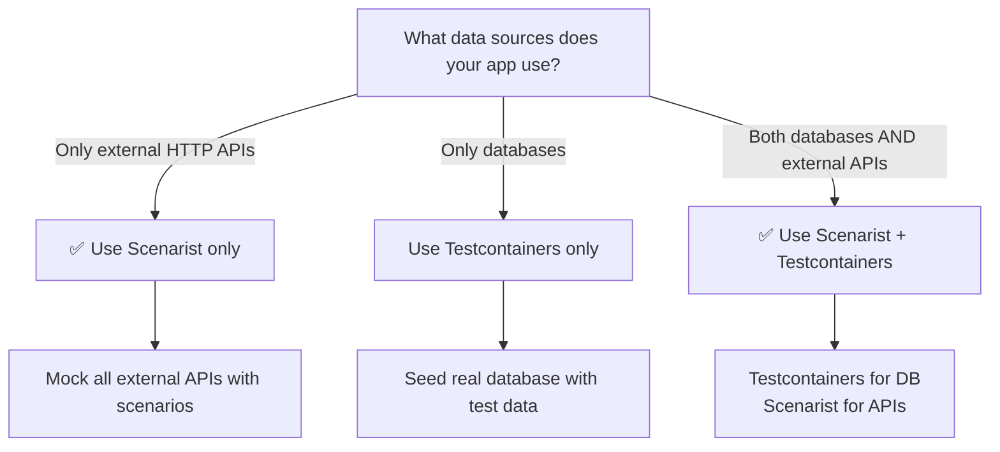

import { Aside, Card, CardGrid } from '@astrojs/starlight/components';

<Aside type="note" title="Scenarist's Scope">

**Scenarist excels at mocking external HTTP APIs.** For apps that also access databases directly, this guide shows the recommended testing strategy combining Scenarist with database testing tools.

</Aside>

## What Scenarist Can and Cannot Mock

<CardGrid>
  <Card title="✅ Scenarist CAN Mock" icon="approve-check">
    - **External HTTP APIs** - Stripe, SendGrid, Auth0
    - **Microservice calls** - REST APIs your app calls externally
    - **Third-party services** - Any outgoing HTTP request
  </Card>

  <Card title="❌ Scenarist CANNOT Mock" icon="error">
    - **Database queries** - Prisma, Drizzle, raw SQL
    - **Internal API routes** - Routes within your Next.js app
    - **File system operations** - fs.readFile, etc.
  </Card>
</CardGrid>

## The Problem with "API Route Abstraction"

You might think: "I'll wrap database calls in API routes, then mock those routes with Scenarist."

**This doesn't work.** Here's why:

```typescript
// ❌ THIS PATTERN IS FLAWED

// Step 1: Create API route that queries database
// app/api/products/route.ts
export async function GET() {
  const products = await prisma.products.findMany(); // Database call
  return NextResponse.json(products);
}

// Step 2: Server Component calls API route
// app/products/page.tsx
export default async function ProductsPage() {
  const response = await fetch('http://localhost:3000/api/products', {
    headers: scenarist.getHeaders(request),
  });
  const products = await response.json();
  return <ProductList products={products} />;
}

// Step 3: Try to mock with Scenarist
export const defaultScenario = {
  mocks: [{
    method: 'GET',
    url: 'http://localhost:3000/api/products', // Internal route!
    response: { status: 200, body: [...] }
  }]
};

// ❌ RESULT: MSW never intercepts this request
// The fetch() to localhost:3000 doesn't leave the Node.js process
// MSW intercepts network requests, not internal function calls
```

**Why MSW can't intercept internal API routes:**
- MSW hooks into Node.js network layer
- `fetch('http://localhost:3000/api/products')` from a Server Component goes through Next.js's internal routing
- The request never leaves the process boundary
- MSW only sees requests that actually traverse the network stack

## Recommended Testing Strategy

**Use the right tool for each job:**

| What You're Testing | Tool to Use |
|---------------------|-------------|
| External HTTP APIs (Stripe, SendGrid) | **Scenarist** |
| Database queries | **Testcontainers** or real test database |
| File system operations | **Mock fs** or real files |

### Recommended Architecture: Scenarist + Testcontainers

```typescript
// Your realistic Server Component (NO code changes needed!)
export default async function CheckoutPage({ params }: { params: { id: string } }) {
  // DATABASE QUERY - Test with Testcontainers (real PostgreSQL)
  const user = await prisma.user.findUnique({
    where: { id: params.id },
  });

  const cart = await prisma.cartItem.findMany({
    where: { userId: params.id },
  });

  // EXTERNAL API - Test with Scenarist
  const recommendations = await fetch('https://api.recommendations.example.com/suggest', {
    headers: {
      'Authorization': `Bearer ${process.env.RECOMMENDATIONS_API_KEY}`,
      ...scenarist.getHeaders(request),
    },
    body: JSON.stringify({ userId: params.id, cartTotal: cart.total }),
  });

  const recs = await recommendations.json();

  return (
    <CheckoutForm
      user={user}
      cart={cart}
      recommendations={recs}
    />
  );
}
```

### Test with Combined Approach

```typescript
// tests/checkout.spec.ts
import { test, expect } from '@playwright/test';
import { PostgreSqlContainer } from '@testcontainers/postgresql';
import { prisma } from '@/lib/prisma';

let container: StartedTestContainer;

test.beforeAll(async () => {
  // Start real PostgreSQL for database queries
  container = await new PostgreSqlContainer().start();

  // Seed test data
  await prisma.user.create({
    data: {
      id: 'user-1',
      email: 'premium@example.com',
      tier: 'premium',
    },
  });

  await prisma.cartItem.createMany({
    data: [
      { userId: 'user-1', productId: 'prod-1', quantity: 2 },
      { userId: 'user-1', productId: 'prod-2', quantity: 1 },
    ],
  });
});

test.afterAll(async () => {
  await container.stop();
});

test('premium user sees personalized recommendations', async ({ page, switchScenario }) => {
  // Scenarist mocks the EXTERNAL recommendation API
  await switchScenario(page, 'premiumRecommendations');

  await page.goto('/checkout/user-1');

  // Database data (from Testcontainers)
  await expect(page.getByText('premium@example.com')).toBeVisible();
  await expect(page.getByText('2 items')).toBeVisible();

  // External API data (from Scenarist)
  await expect(page.getByText('Premium Laptop Stand')).toBeVisible();
  await expect(page.getByText('Premium USB-C Hub')).toBeVisible();
});
```

### Scenario for External API Only

```typescript
// lib/scenarios.ts
export const premiumRecommendationsScenario: ScenaristScenario = {
  id: 'premiumRecommendations',
  mocks: [
    {
      // ✅ EXTERNAL API - Scenarist can intercept this
      method: 'POST',
      url: 'https://api.recommendations.example.com/suggest',
      match: {
        body: { tier: 'premium' },
      },
      response: {
        status: 200,
        body: {
          products: [
            { id: 'rec-1', name: 'Premium Laptop Stand', price: 89.99 },
            { id: 'rec-2', name: 'Premium USB-C Hub', price: 129.99 },
          ],
        },
      },
    },
  ],
};

export const standardRecommendationsScenario: ScenaristScenario = {
  id: 'standardRecommendations',
  mocks: [
    {
      method: 'POST',
      url: 'https://api.recommendations.example.com/suggest',
      response: {
        status: 200,
        body: {
          products: [
            { id: 'rec-1', name: 'Basic Mouse Pad', price: 14.99 },
            { id: 'rec-2', name: 'Basic Cable Organizer', price: 9.99 },
          ],
        },
      },
    },
  ],
};
```

## When to Use Which Approach

### Scenarist Only (No Database)

**Use when:** Your Next.js app fetches data exclusively from external HTTP APIs.

```typescript
// All data from external APIs - perfect for Scenarist
export default async function ProductsPage() {
  const products = await fetch('https://api.catalog.example.com/products', {
    headers: scenarist.getHeaders(request),
  });

  const pricing = await fetch('https://api.pricing.example.com/prices', {
    headers: scenarist.getHeaders(request),
  });

  return <ProductList products={products} prices={pricing} />;
}
```

### Testcontainers Only (No External APIs)

**Use when:** Your app only uses databases, no external HTTP APIs.

```typescript
// All data from database - use Testcontainers only
export default async function DashboardPage({ params }) {
  const user = await prisma.user.findUnique({ where: { id: params.id } });
  const orders = await prisma.order.findMany({ where: { userId: params.id } });

  return <Dashboard user={user} orders={orders} />;
}
```

### Hybrid: Scenarist + Testcontainers

**Use when:** Your app uses both databases AND external HTTP APIs.

This is the **recommended approach for production applications**.

## What About API Routes That Proxy External Services?

**This pattern DOES work with Scenarist:**

```typescript
// ✅ API route that proxies EXTERNAL service
// app/api/recommendations/route.ts
export async function GET(request: NextRequest) {
  const tier = request.headers.get('x-user-tier') || 'standard';

  // This calls an EXTERNAL service - MSW CAN intercept this
  const response = await fetch('https://api.recommendations.example.com/suggest', {
    headers: {
      'x-user-tier': tier,
      ...getTestHeaders(request),
    },
  });

  return NextResponse.json(await response.json());
}

// Now your Server Component calls the internal route
export default async function ProductsPage() {
  const response = await fetch('http://localhost:3000/api/recommendations', {
    headers: scenarist.getHeaders(request),
  });
  // ...
}
```

**Why this works:** The API route makes an **external** HTTP call to `https://api.recommendations.example.com`. MSW intercepts that external call.

**Why internal database calls don't work:** An API route that does `await prisma.findMany()` makes no HTTP call at all.

## Decision Tree



## Common Misconception: "But the Docs Say..."

You might have read advice suggesting you can:
1. Wrap database calls in API routes
2. Have Server Components call those routes
3. Mock the routes with MSW/Scenarist

**This advice is architecturally incorrect** for Node.js-based MSW because:
- MSW intercepts at the network level
- Internal Next.js routing doesn't traverse the network
- The request never leaves the process boundary

**The confusion comes from:** Browser-based MSW, which intercepts Service Worker requests. In the browser, `fetch('/api/products')` does make a network request. In Node.js Server Components, it doesn't.

## Performance Considerations

### Testcontainers Startup

**Trade-off:** Testcontainers add 5-30 seconds startup time per test suite.

**Mitigation:**
```typescript
// Use a single container for all tests
let container: StartedTestContainer;

test.beforeAll(async () => {
  container = await new PostgreSqlContainer().start();
});

test.afterAll(async () => {
  await container.stop();
});

// Individual tests are fast after initial startup
test('test 1', async () => { /* ~100ms */ });
test('test 2', async () => { /* ~100ms */ });
```

### CI/CD Requirements

Testcontainers requires Docker. Ensure your CI environment supports it:
- ✅ GitHub Actions (Docker available)
- ✅ GitLab CI (Docker available)
- ✅ CircleCI (Docker available)
- ⚠️ Some serverless CI - may need configuration

## Summary

1. **Scenarist mocks external HTTP APIs** - Calls that leave your application
2. **Scenarist cannot mock databases** - No HTTP request = nothing to intercept
3. **Scenarist cannot mock internal API routes** - They don't traverse the network in Node.js
4. **Use Testcontainers for databases** - Real PostgreSQL/MySQL in containers
5. **Combine both when needed** - Many apps use both databases AND external APIs
6. **API routes that proxy external services work** - The external call is intercepted

**Use Scenarist for what it's designed for (external APIs), and Testcontainers for what it's designed for (databases).**

## Next Steps

- [Testcontainers Documentation](https://testcontainers.com/) - Real database containers for testing
- [Next.js App Router Getting Started](/frameworks/nextjs-app-router/getting-started) - Set up Scenarist
- [Testcontainers Hybrid](/guides/testing-database-apps/testcontainers-hybrid) - Complete working example

## Appendix: What Was Previously Recommended (and Why It's Wrong)

<Aside type="caution" title="Previous (Incorrect) Guidance">

Previous documentation recommended the "API Route Abstraction" pattern for database testing. After deep investigation, we discovered this pattern is architecturally flawed.

**The pattern:**
1. Wrap database calls in API routes
2. Have Server Components call those routes
3. Mock the routes with Scenarist

**Why it fails:**
- Server Components calling `fetch('http://localhost:3000/api/...')` don't make network requests
- Next.js handles internal routing without traversing the network stack
- MSW only intercepts actual network traffic

**The fix:** Use Testcontainers for database testing, Scenarist for external API testing.

</Aside>
