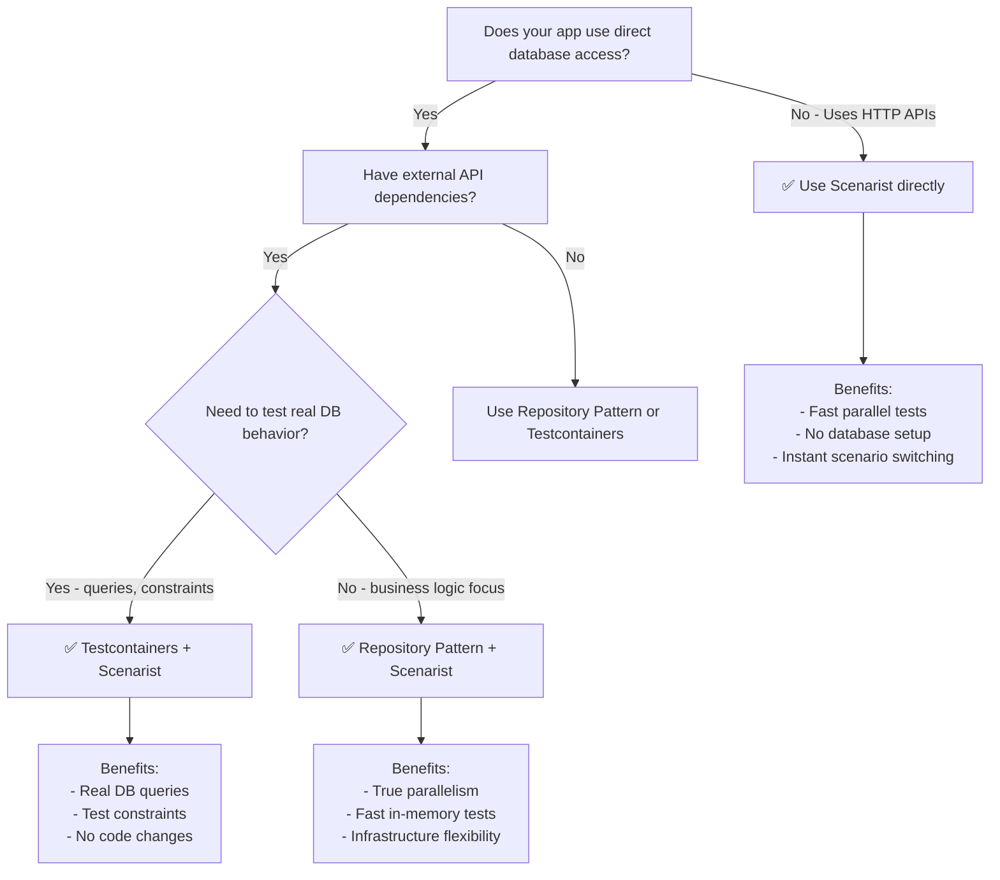

import { Aside } from '@astrojs/starlight/components';

<Aside type="note" title="Scenarist's Scope">

**Scenarist excels at mocking external HTTP APIs.** For apps that also access databases directly, this guide shows the recommended testing strategy combining Scenarist with database testing tools.

</Aside>

## The Problem

**Next.js apps with direct database access are not directly testable with Scenarist:**

```typescript
// ❌ Scenarist CANNOT mock this - no HTTP request
// app/lib/data.ts
import { db } from './db';

export async function fetchProducts() {
  return await db.products.findMany();
}

// app/products/page.tsx - Server Component
export default async function ProductsPage() {
  const products = await fetchProducts(); // Direct database call
  return <ProductList products={products} />;
}
```

**Why this doesn't work:**
- `db.products.findMany()` is a direct function call to the database driver
- No HTTP request is made
- MSW (which Scenarist uses) only intercepts `fetch()` calls
- Database connections use TCP sockets, not HTTP

<Aside type="caution">
Scenarist intercepts HTTP requests only. It cannot mock:
- Database calls (PostgreSQL, MongoDB, MySQL, etc.)
- File system operations (`fs.readFile`, `fs.writeFile`)
- WebSocket connections
- gRPC calls
- Direct function calls or imports
</Aside>

## Testing Approaches

Many techniques work for database testing—real test databases, in-memory databases, container-based solutions, or application-level abstractions. Choose what fits your team's workflow.

### Start Simple: Sequential Execution

For most teams, **start with sequential execution**. It's the simplest approach:
- Run database tests sequentially
- Run HTTP tests in parallel (Scenarist handles isolation)
- No code changes required

This works well until your database test suite grows large enough that speed becomes a concern.

[See all parallelism options →](./parallelism-options)

### When You Need Parallelism

If sequential execution becomes too slow, you have several options depending on your priorities:

**Repository Pattern** - Best for test-level parallelism
- Provides same test ID isolation model as Scenarist
- Requires abstracting database access behind interfaces
- Best for teams who value clean architecture

[Learn about the Repository Pattern →](./repository-pattern)

**Testcontainers** - Best for testing real database behavior
- Tests actual SQL queries, constraints, transactions
- No code changes required
- Sequential test execution (database state is shared)

[Learn about Testcontainers Hybrid →](./testcontainers-hybrid)

**Sharding** - Best for parallelism without code changes
- One database container per Playwright shard
- Shard-level parallelism (not test-level)
- Requires good CI/CD infrastructure

[See all parallelism options →](./parallelism-options)

### Other Approaches

Other valid database testing strategies include:
- **Real test database** with seeding scripts
- **In-memory database** (SQLite for development, real DB in CI)
- **Database mocking** at the ORM level (Prisma mock, etc.)

Use whatever approach fits your team. Scenarist handles the external API mocking regardless of how you test your database layer.

## Decision Tree



## When to Use Each Tool

| What You're Testing | Tool to Use |
|---------------------|-------------|
| External HTTP APIs (Stripe, SendGrid) | **Scenarist** |
| Database queries | **Testcontainers** or real test database |
| File system operations | **Mock fs** or real files |

## Next Steps

- [Testcontainers Hybrid →](./testcontainers-hybrid) - Complete guide to using Testcontainers with Scenarist
- [Next.js App Router Getting Started](/frameworks/nextjs-app-router/getting-started)
- [Next.js Pages Router Getting Started](/frameworks/nextjs-pages-router/getting-started)
