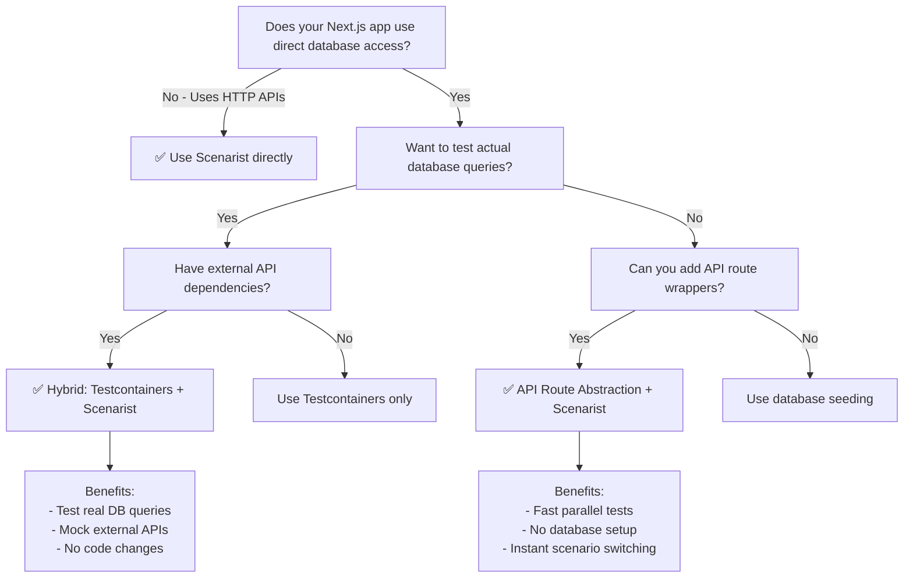

import { Aside } from '@astrojs/starlight/components';

Most production Next.js applications fetch data from databases (PostgreSQL, MongoDB, etc.) rather than external HTTP APIs. Since Scenarist intercepts HTTP requests via MSW, it cannot directly mock database calls. This guide shows you how to make database-heavy Next.js apps testable with Scenarist.

## The Problem

**Next.js apps with direct database access are not directly testable with Scenarist:**

```typescript
// ❌ Scenarist CANNOT mock this - no HTTP request
// app/lib/data.ts
import { db } from './db';

export async function fetchProducts() {
  return await db.products.findMany();
}

// app/products/page.tsx - Server Component
export default async function ProductsPage() {
  const products = await fetchProducts(); // Direct database call
  return <ProductList products={products} />;
}
```

**Why this doesn't work:**
- `db.products.findMany()` is a direct function call to the database driver
- No HTTP request is made
- MSW (which Scenarist uses) only intercepts `fetch()` calls
- Database connections use TCP sockets, not HTTP

<Aside type="caution">
Scenarist intercepts HTTP requests only. It cannot mock:
- Database calls (PostgreSQL, MongoDB, MySQL, etc.)
- File system operations (`fs.readFile`, `fs.writeFile`)
- WebSocket connections
- gRPC calls
- Direct function calls or imports
</Aside>

## Two Approaches

You have two options for testing database-heavy Next.js apps with Scenarist:

### Approach 1: API Route Abstraction + Scenarist

**Best for:** Teams willing to add thin HTTP layer for fast, parallel tests

Add API routes between Server Components and database. Mock the HTTP layer with Scenarist. This gives you instant scenario switching and parallel test execution without database setup.

**Key benefits:**
- ✅ Fast tests (instant scenario switching)
- ✅ No database setup required
- ✅ Run tests in parallel with different data
- ✅ Mock both database data AND external APIs

**Trade-offs:**
- ⚠️ Requires code changes (adding API routes)
- ⚠️ Doesn't test actual database queries

[Learn more about API Route Abstraction →](./api-route-abstraction)

### Approach 2: Testcontainers + Scenarist Hybrid

**Best for:** Teams that cannot/won't refactor to use API routes

Use Testcontainers to spin up real database containers with seeded scenarios. Use Scenarist to mock external APIs. No code changes needed.

**Key benefits:**
- ✅ No code changes required
- ✅ Tests actual database queries and migrations
- ✅ Mock external APIs with Scenarist
- ✅ Realistic integration testing

**Trade-offs:**
- ⚠️ Slower tests (5-30s container startup)
- ⚠️ Docker required in CI/CD
- ⚠️ Must maintain database seeding scripts

[Learn more about Testcontainers Hybrid →](./testcontainers-hybrid)

## Decision Tree



## Which Approach Should You Choose?

**Choose API Route Abstraction if:**
- You want fast tests with instant scenario switching
- You can add thin API route wrappers
- You don't need to test database-specific behavior (transactions, constraints)
- Parallel test execution is important

**Choose Testcontainers Hybrid if:**
- You cannot or won't refactor to add API routes
- You need to test actual database queries and migrations
- Your team prefers realistic database integration testing
- Test startup time (5-30s) is acceptable

**Use both approaches together if:**
- Some parts of your app can use API routes (fast tests)
- Other parts require database testing (comprehensive coverage)
- You want maximum flexibility in your test strategy

## Next Steps

Choose your approach and dive into the detailed implementation guide:

- [API Route Abstraction →](./api-route-abstraction) - Step-by-step guide to adding API routes and mocking with Scenarist
- [Testcontainers Hybrid →](./testcontainers-hybrid) - Complete guide to using Testcontainers with Scenarist

Both approaches work with App Router and Pages Router.
