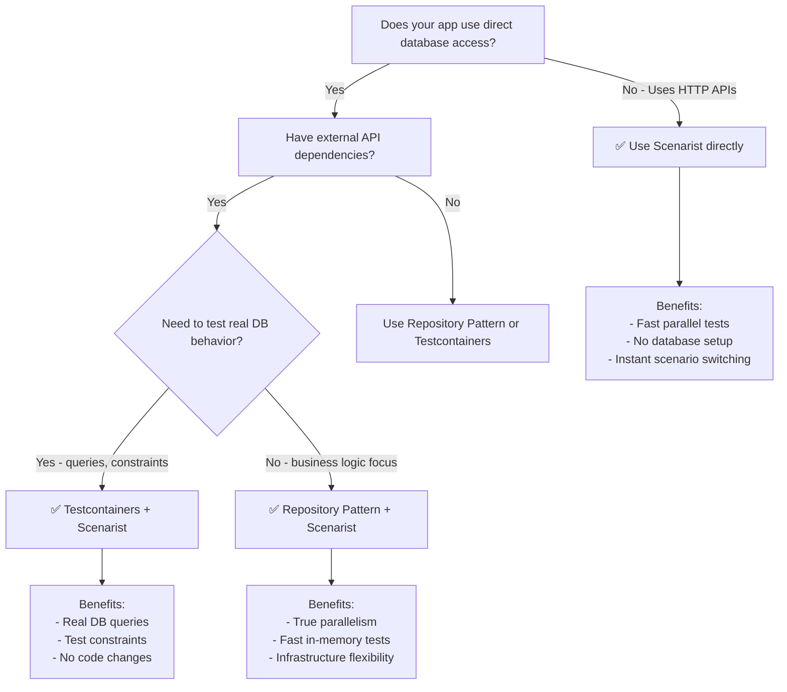

import { Aside } from '@astrojs/starlight/components';

<Aside type="note" title="Scenarist's Scope">

**Scenarist excels at mocking external HTTP APIs.** For apps that also access databases directly, this guide shows the recommended testing strategy combining Scenarist with database testing tools.

</Aside>

## The Problem

**Next.js apps with direct database access are not directly testable with Scenarist:**

```typescript
// ❌ Scenarist CANNOT mock this - no HTTP request
// app/lib/data.ts
import { db } from './db';

export async function fetchProducts() {
  return await db.products.findMany();
}

// app/products/page.tsx - Server Component
export default async function ProductsPage() {
  const products = await fetchProducts(); // Direct database call
  return <ProductList products={products} />;
}
```

**Why this doesn't work:**
- `db.products.findMany()` is a direct function call to the database driver
- No HTTP request is made
- MSW (which Scenarist uses) only intercepts `fetch()` calls
- Database connections use TCP sockets, not HTTP

<Aside type="caution">
Scenarist intercepts HTTP requests only. It cannot mock:
- Database calls (PostgreSQL, MongoDB, MySQL, etc.)
- File system operations (`fs.readFile`, `fs.writeFile`)
- WebSocket connections
- gRPC calls
- Direct function calls or imports
</Aside>

## Testing Approaches

Many techniques work for database testing—real test databases, in-memory databases, container-based solutions, or application-level abstractions. Choose what fits your team's workflow.

### Our Recommendation: Repository Pattern + Scenarist

For apps that use both databases AND external HTTP APIs, we recommend the **repository pattern**:
- **Repository pattern** for database access (abstractions with test ID isolation)
- **Scenarist** for mocking external APIs (Stripe, Auth0, SendGrid)

**Key benefits:**
- ✅ True test parallelism with test ID isolation
- ✅ Fast in-memory test execution
- ✅ Infrastructure flexibility (swap databases, ORMs, architectures)
- ✅ Follows SOLID principles and clean architecture
- ✅ Mock external APIs with Scenarist

**The investment:**
- Requires abstracting database access behind interfaces
- Separate tests needed for real database behavior (repository implementation tests)

**The biggest win:** This pattern enables your entire server codebase—business logic, middleware, route handlers—to be tested in parallel with full isolation. That's powerful. Just complement with repository implementation tests for database-specific concerns.

[Learn more about the Repository Pattern →](./repository-pattern)

### Alternative: Testcontainers

If you need to test actual database behavior (queries, constraints, transactions), combine Testcontainers with Scenarist:
- **Testcontainers** for real PostgreSQL/MySQL in Docker containers
- **Scenarist** for mocking external APIs

**Trade-offs:**
- ⚠️ Sequential test execution (database state is shared)
- ⚠️ Container startup overhead
- ⚠️ Docker required in CI/CD

[Learn more about Testcontainers Hybrid →](./testcontainers-hybrid)

### Other Approaches

Other valid database testing strategies include:
- **Real test database** with seeding scripts
- **In-memory database** (SQLite for development, real DB in CI)
- **Database mocking** at the ORM level (Prisma mock, etc.)

Use whatever approach fits your team. Scenarist handles the external API mocking regardless of how you test your database layer.

## Decision Tree



## When to Use Each Tool

| What You're Testing | Tool to Use |
|---------------------|-------------|
| External HTTP APIs (Stripe, SendGrid) | **Scenarist** |
| Database queries | **Testcontainers** or real test database |
| File system operations | **Mock fs** or real files |

## Next Steps

- [Testcontainers Hybrid →](./testcontainers-hybrid) - Complete guide to using Testcontainers with Scenarist
- [Next.js App Router Getting Started](/frameworks/nextjs-app-router/getting-started)
- [Next.js Pages Router Getting Started](/frameworks/nextjs-pages-router/getting-started)
