import { Card, CardGrid } from '@astrojs/starlight/components';

## Your Backend Code Actually Runs

**Unlike pure mocking solutions, Scenarist tests your real application logic.** Your Server Components execute, your API routes process requests, your business logic validates data. Only external API calls (Stripe, SendGrid, etc.) are mocked. This means you're testing the actual code that runs in production, not just mock responses.

:::tip[The Critical Difference]
**Traditional MSW approach:** Mock everything → Your backend never runs → You're testing mocks, not your code

**Scenarist approach:** Mock only external APIs → Your backend runs normally → You're testing real application behavior
:::

Works with **Express**, **Next.js** (Pages + App Router), **Fastify**, **Hono**, **Remix**, and **SvelteKit**.

---

## Why Scenarist?

| Feature | Jest/Vitest | Playwright Alone | MSW Alone | Cypress | **Scenarist + Playwright** |
|---------|-------------|------------------|-----------|---------|----------------------------|
| **Test Type** | Unit tests | E2E tests | HTTP mocking | E2E tests | **Full-stack integration** |
| **Your Backend Runs** | N/A (no server) | ⚠️ Optional¹ | ❌ Never runs | ❌ Stubs only | ✅ **Always executes** |
| **Server Components** | ❌ Can't test | ⚠️ If backend runs¹ | ❌ Never execute | ❌ Not supported | ✅ **Real execution** |
| **Full User Journeys** | ❌ No browser | ✅ Yes | ❌ No browser | ✅ Yes | ✅ **Yes** |
| **Change Scenarios** | N/A | Restart app² | Restart app | Restart tests | ✅ **Instant switching** |
| **Parallel Tests** | ✅ Fast | ✅ Yes | ❌ Shared state³ | ⚠️ Limited | ✅ **Perfect isolation** |
| **Test Speed** | ✅ Instant | ⚠️ Slow²⁴ | Slow (restarts) | Slow | ✅ **Fast** |
| **State Management** | N/A | Manual setup | Manual setup | Manual setup | ✅ **Built-in capture** |

:::tip[Why This Matters]
**Jest/Vitest**: Can't test Server Components or browser flows
**Playwright alone**: Either slow (real backend with restarts) or your backend never runs (mocked)
**MSW alone**: Backend never executes—you're testing mock responses, not your code
**Cypress**: Stubs everything—Server Components never render, validation never runs

**Scenarist + Playwright**: Real backend execution + instant scenario switching + built-in state = fast integration tests
:::

<small>¹Playwright *can* run with real backend, but requires app restart per scenario (slow)
²Changing scenarios = restart app = slow feedback loop
³Shared MSW handlers cause test pollution and flaky tests
⁴Fast if mocking backend (but then backend doesn't run)</small>

## The E2E Testing Problem

<CardGrid stagger>
  <Card title="❌ App Restart Hell" icon="refresh">
    Want to test checkout with payment errors? Restart your entire app. Precious development time wasted per scenario.
  </Card>
  <Card title="❌ Test Pollution" icon="error">
    Shared MSW handlers cause flaky tests. Shopping cart from test A appears in test B.
  </Card>
  <Card title="❌ Sequential Execution" icon="warning">
    Can't run parallel tests with different backend states. Test suites take hours.
  </Card>
  <Card title="❌ Scattered Mocks" icon="puzzle">
    Copy-paste cart setup across dozens of test files. Change one field, update every file.
  </Card>
</CardGrid>

---

## The Scenarist Solution

<CardGrid stagger>
  <Card title="✅ Complete Journeys" icon="rocket">
    **Test multi-step flows end-to-end in one test.** Shopping cart → Checkout → Payment → Confirmation. Your Server Components execute, your validation runs, your error handling gets tested.
  </Card>
  <Card title="✅ Instant Switching" icon="setting">
    **Change backend states instantly without app restarts.** Switch from "payment success" to "payment error" in milliseconds. Dramatically faster test suites.
  </Card>
  <Card title="✅ Perfect Isolation" icon="approve-check">
    **Every test gets isolated scenario and state.** Run large test suites concurrently without conflicts. Test shopping cart in 100 parallel tests with different items.
  </Card>
  <Card title="✅ Centralized Scenarios" icon="star">
    **Define complete flows once, reuse everywhere.** Single source of truth for checkout journey. Change one scenario file, all tests update automatically.
  </Card>
</CardGrid>

## How It Works

```mermaid
%%{init: {'theme':'base', 'themeVariables': { 'fontSize':'18px'}}}%%
graph TB
    subgraph test["🧪 TEST ENVIRONMENT"]
        browser["🌐 Browser<br/>Playwright"]
        backend["⚙️ YOUR BACKEND<br/>✅ Runs Normally<br/><br/>Server Components<br/>API Routes<br/>Business Logic"]
        mock["🎭 SCENARIST<br/>MSW Mock Layer<br/><br/>Intercepts External APIs<br/>Returns Test Data"]
        external["🚫 External APIs<br/>Stripe, Payment Gateways<br/><br/>Never Reached"]

        browser -->|"Your API Request"| backend
        backend -->|"External API Call"| mock
        mock -.->|"❌ Blocked"| external
    end

    style test fill:#f9fafb,stroke:#374151,stroke-width:2px
    style browser fill:#dbeafe,stroke:#2563eb,stroke-width:2px
    style backend fill:#d1fae5,stroke:#059669,stroke-width:3px
    style mock fill:#fed7aa,stroke:#ea580c,stroke-width:2px
    style external fill:#fecaca,stroke:#dc2626,stroke-width:2px,stroke-dasharray: 5 5
```



<CardGrid>
  <Card title="✅ Your Backend Runs" icon="approve-check">
    **Your actual application code executes:**
    - Server Components render with real data flow
    - API route handlers process requests
    - Business logic validates and transforms data
    - Error handling executes and gets tested
    - Database queries run (against test DB)

    **You're testing real application behavior, not mock responses.**
  </Card>

  <Card title="🎭 Only External APIs Mocked" icon="warning">
    **Scenarist intercepts outbound calls:**
    - Stripe payment processing → test response
    - SendGrid email sending → test confirmation
    - Third-party APIs → test data

    **Your code makes real HTTP calls, they're just intercepted at the network layer.**
  </Card>
</CardGrid>

:::note[Why This Matters]
Traditional E2E testing with pure MSW means your backend never runs—you're testing mock responses, not your actual code. **Scenarist is different:** your Next.js Server Components execute, your Express routes process requests, your validation logic runs. The only things mocked are external dependencies you don't control (payment gateways, email services, etc.).

This gives you **true integration testing** with the speed and reliability of unit tests.
:::

## Quick Example

```typescript
// Define scenario once
export const checkoutScenario = {
  mocks: [
    { method: 'GET', url: '/api/products', response: { products: [...] } },
    { method: 'POST', url: '/api/cart/add', captureState: { 'cart[]': 'body.item' } },
    { method: 'GET', url: '/api/cart', response: { items: '{{state.cart}}' } },
    { method: 'POST', url: '/api/checkout', response: { success: true } },
  ]
};

// Test complete journey
test('checkout flow', async ({ page }) => {
  await switchScenario(page, 'checkout-success');

  await page.goto('/products');
  await page.click('[data-product="1"]');  // Your backend runs
  await page.goto('/cart');                 // State captured & injected
  await page.click('Checkout');             // Validation executes

  await expect(page.locator('.success')).toBeVisible();
});

// Switch scenarios instantly
test('payment error', async ({ page }) => {
  await switchScenario(page, 'payment-error');  // No restart needed
  // ... same test, different backend behavior
});
```

**What's happening:** Your Next.js Server Components render, your API routes validate data, your error handling executes. Only external API calls (Stripe, etc.) are mocked.

## Get Started

<CardGrid>
  <Card title="Express APIs" icon="seti:nodejs">
    REST APIs, GraphQL servers, microservices. Zero boilerplate with AsyncLocalStorage.

    [Get Started →](/frameworks/express/getting-started)
  </Card>
  <Card title="Next.js (Pages + App Router)" icon="seti:next">
    Full-stack testing with Server Components, Server Actions, and API routes.

    [Get Started →](/frameworks/nextjs/pages/getting-started)
  </Card>
  <Card title="Any Node.js Framework" icon="rocket">
    Fastify, Hono, Remix, SvelteKit, tRPC. Hexagonal architecture means framework-agnostic core.

    [Learn More →](/concepts/scenarios)
  </Card>
  <Card title="Core Capabilities" icon="star">
    Dynamic matching, response sequences, stateful mocks, test isolation.

    [View Features →](/concepts/scenarios)
  </Card>
</CardGrid>
