import { Card, CardGrid } from '@astrojs/starlight/components';

## Your Backend Code Actually Runs

**Unlike pure mocking solutions, Scenarist tests your real application logic.** Your Server Components execute, your API routes process requests, your business logic validates data. Only external API calls (Stripe, SendGrid, etc.) are mocked. This means you're testing the actual code that runs in production, not just mock responses.

:::tip[The Critical Difference]
**Traditional MSW approach:** Mock everything → Your backend never runs → You're testing mocks, not your code

**Scenarist approach:** Mock only external APIs → Your backend runs normally → You're testing real application behavior
:::

Works with **Express**, **Next.js** (Pages + App Router), **Fastify**, **Hono**, **Remix**, and **SvelteKit**.

---

## Fast E2E Testing for Full-Stack Frameworks

**Next.js, Remix, and SvelteKit require E2E testing for Server Components and loaders.** The Next.js team explicitly recommends "End-to-End Testing over Unit Testing for async [Server] components." But traditional E2E testing is painfully slow—restarting your app for every scenario wastes valuable development time, shared MSW handlers cause flaky tests, and you can't run tests in parallel with different backend states.

**Scenarist makes E2E testing as fast as unit tests.** Switch backend scenarios instantly without restarting your app. Run large test suites concurrently with perfect isolation. Test shopping cart flows, checkout journeys, and payment processing end-to-end—all in the browser with real Server Components executing real backend logic.

## The E2E Testing Problem

<CardGrid stagger>
  <Card title="❌ App Restart Hell" icon="refresh">
    Want to test checkout with payment errors? Restart your entire app. Precious development time wasted per scenario.
  </Card>
  <Card title="❌ Test Pollution" icon="error">
    Shared MSW handlers cause flaky tests. Shopping cart from test A appears in test B.
  </Card>
  <Card title="❌ Sequential Execution" icon="warning">
    Can't run parallel tests with different backend states. Test suites take hours.
  </Card>
  <Card title="❌ Scattered Mocks" icon="puzzle">
    Copy-paste cart setup across dozens of test files. Change one field, update every file.
  </Card>
</CardGrid>

---

## The Scenarist Solution

<CardGrid stagger>
  <Card title="✅ Complete Journeys" icon="rocket">
    **Test multi-step flows end-to-end in one test.** Shopping cart → Checkout → Payment → Confirmation. Your Server Components execute, your validation runs, your error handling gets tested.
  </Card>
  <Card title="✅ Instant Switching" icon="setting">
    **Change backend states instantly without app restarts.** Switch from "payment success" to "payment error" in milliseconds. Dramatically faster test suites.
  </Card>
  <Card title="✅ Perfect Isolation" icon="approve-check">
    **Every test gets isolated scenario and state.** Run large test suites concurrently without conflicts. Test shopping cart in 100 parallel tests with different items.
  </Card>
  <Card title="✅ Centralized Scenarios" icon="star">
    **Define complete flows once, reuse everywhere.** Single source of truth for checkout journey. Change one scenario file, all tests update automatically.
  </Card>
</CardGrid>

## Why Full-Stack Frameworks Need This

Modern full-stack frameworks (Next.js, Remix, SvelteKit) make testing complete flows harder than traditional backend APIs:

### The Full-Stack Testing Problem

**Traditional Backend API (Express, Fastify):**
- Test routes in isolation
- Mock external APIs easily
- Fast feedback loops
- ✅ **Already works great with Scenarist**

**Full-Stack Frameworks (Next.js App Router, Remix):**
- Server + client code intermixed
- Server Components fetch during render
- Loader data flows to components
- **Testing requires browser + backend together**

> "Since async Server Components are new to the React ecosystem, some tools do not fully support them. In the meantime, we recommend using End-to-End Testing over Unit Testing for async components."
> — Next.js Official Docs

**Translation:** You need E2E tests. But E2E tests with MSW alone = slow, polluted, sequential hell.

**Scenarist Solution:** Fast E2E tests with runtime scenario switching, perfect isolation, and complete journey support. Test your full-stack app like a backend API.

### Works With Any Node.js Framework

- ✅ **Express** - Full support (AsyncLocalStorage)
- ✅ **Next.js** - Pages Router + App Router (Server Components)
- 🔜 **Fastify** - High-performance async framework
- 🔜 **Hono** - Edge runtime compatible
- 🔜 **Remix** - Full-stack React framework
- 🔜 **SvelteKit** - Svelte full-stack framework

## How It Works: Real Backend + Mocked External APIs



<CardGrid>
  <Card title="✅ Your Backend Runs" icon="approve-check">

```mermaid
%%{init: {'theme':'base', 'themeVariables': { 'fontSize':'18px'}}}%%
graph TB
    subgraph test["🧪 TEST ENVIRONMENT"]
        browser["🌐 Browser<br/>Playwright"]
        backend["⚙️ YOUR BACKEND<br/>✅ Runs Normally<br/><br/>Server Components<br/>API Routes<br/>Business Logic"]
        mock["🎭 SCENARIST<br/>MSW Mock Layer<br/><br/>Intercepts External APIs<br/>Returns Test Data"]
        external["🚫 External APIs<br/>Stripe, Payment Gateways<br/><br/>Never Reached"]

        browser -->|"Your API Request"| backend
        backend -->|"External API Call"| mock
        mock -.->|"❌ Blocked"| external
    end

    style test fill:#f9fafb,stroke:#374151,stroke-width:2px
    style browser fill:#dbeafe,stroke:#2563eb,stroke-width:2px
    style backend fill:#d1fae5,stroke:#059669,stroke-width:3px
    style mock fill:#fed7aa,stroke:#ea580c,stroke-width:2px
    style external fill:#fecaca,stroke:#dc2626,stroke-width:2px,stroke-dasharray: 5 5
```

    **Your actual application code executes:**
    - Server Components render with real data flow
    - API route handlers process requests
    - Business logic validates and transforms data
    - Error handling executes and gets tested
    - Database queries run (against test DB)

    **You're testing real application behavior, not mock responses.**
  </Card>

  <Card title="🎭 Only External APIs Mocked" icon="warning">
    **Scenarist intercepts outbound calls:**
    - Stripe payment processing → test response
    - SendGrid email sending → test confirmation
    - Third-party APIs → test data

    **Your code makes real HTTP calls, they're just intercepted at the network layer.**
  </Card>
</CardGrid>

:::note[Why This Matters]
Traditional E2E testing with pure MSW means your backend never runs—you're testing mock responses, not your actual code. **Scenarist is different:** your Next.js Server Components execute, your Express routes process requests, your validation logic runs. The only things mocked are external dependencies you don't control (payment gateways, email services, etc.).

This gives you **true integration testing** with the speed and reliability of unit tests.
:::

## Complete Journey Example

Test a full shopping cart → checkout → payment flow in one test:

```typescript
// Define scenario once (in scenarios.ts)
import type { ScenarioDefinition } from '@scenarist/core';

export const checkoutSuccessScenario: ScenarioDefinition = {
  id: 'checkout-success',
  name: 'Successful Checkout Journey',
  mocks: [
    // Step 1: Browse products
    {
      method: 'GET',
      url: '/api/products',
      response: { status: 200, body: { products: [...] } },
    },
    // Step 2: Add to cart (capture item)
    {
      method: 'POST',
      url: '/api/cart/add',
      captureState: { 'cartItems[]': 'body.item' },  // Append to cart
      response: { status: 200, body: { success: true } },
    },
    // Step 3: View cart (inject captured items)
    {
      method: 'GET',
      url: '/api/cart',
      response: {
        status: 200,
        body: { items: '{{state.cartItems}}', count: '{{state.cartItems.length}}' }
      },
    },
    // Step 4: Checkout (capture order ID)
    {
      method: 'POST',
      url: '/api/checkout',
      captureState: { 'orderId': 'body.id' },
      response: { status: 200, body: { orderId: '12345' } },
    },
    // Step 5: Payment (uses captured order)
    {
      method: 'POST',
      url: '/api/payment',
      response: { status: 200, body: { success: true, order: '{{state.orderId}}' } },
    },
  ],
};

// Test complete journey in one test
test('successful checkout flow', async ({ page }) => {
  await switchScenario(page, 'checkout-success');

  // Complete user journey - all steps work together
  await page.goto('/products');
  await page.click('[data-product="1"]');      // Adds to cart (captured)
  await page.goto('/cart');                     // Shows captured items
  await expect(page.locator('.cart-item')).toBeVisible();

  await page.click('Proceed to Checkout');
  await page.fill('#card-number', '4242...');
  await page.click('Pay Now');                  // Uses captured cart + order

  await expect(page.locator('.success')).toContainText('Order confirmed');
});

// Test error scenario with different backend state
test('payment failure handling', async ({ page }) => {
  await switchScenario(page, 'payment-error');  // Instant switch, no restart

  // Same journey, different backend state
  await page.goto('/products');
  await page.click('[data-product="1"]');
  await page.goto('/cart');
  await page.click('Proceed to Checkout');
  await page.fill('#card-number', '4242...');
  await page.click('Pay Now');

  await expect(page.locator('.error')).toContainText('Payment declined');
});

// Both tests run in parallel with isolated state
```

## Get Started

<CardGrid>
  <Card title="Express APIs" icon="seti:nodejs">
    REST APIs, GraphQL servers, microservices. Zero boilerplate with AsyncLocalStorage.

    [Get Started →](/frameworks/express/getting-started)
  </Card>
  <Card title="Next.js (Pages + App Router)" icon="seti:next">
    Full-stack testing with Server Components, Server Actions, and API routes.

    [Get Started →](/frameworks/nextjs/pages/getting-started)
  </Card>
  <Card title="Any Node.js Framework" icon="rocket">
    Fastify, Hono, Remix, SvelteKit, tRPC. Hexagonal architecture means framework-agnostic core.

    [Learn More →](/concepts/scenarios)
  </Card>
  <Card title="Core Capabilities" icon="star">
    Dynamic matching, response sequences, stateful mocks, test isolation.

    [View Features →](/concepts/scenarios)
  </Card>
</CardGrid>
