import { Card, CardGrid } from '@astrojs/starlight/components';

## Fast E2E Testing for Full-Stack Frameworks

**Next.js, Remix, and SvelteKit require E2E testing for Server Components and loaders.** The Next.js team explicitly recommends "End-to-End Testing over Unit Testing for async [Server] components." But traditional E2E testing is painfully slow—restarting your app for every scenario wastes valuable development time, shared MSW handlers cause flaky tests, and you can't run tests in parallel with different backend states.

**Scenarist makes E2E testing as fast as unit tests.** Switch backend scenarios instantly without restarting your app. Run large test suites concurrently with perfect isolation. Test shopping cart flows, checkout journeys, and payment processing end-to-end—all in the browser with real Server Components.

Works with **Express**, **Next.js** (Pages + App Router), **Fastify**, **Hono**, **Remix**, and **SvelteKit**.

## The Problem

Testing complete user journeys with different backend states is painful:

<CardGrid>
  <Card title="❌ App Restart Hell" icon="refresh">
    Want to test checkout with payment errors? Restart your entire app. Precious development time wasted per scenario.
  </Card>
  <Card title="❌ Test Pollution" icon="error">
    Shared MSW handlers cause flaky tests. Shopping cart from test A appears in test B.
  </Card>
  <Card title="❌ Sequential Execution" icon="warning">
    Can't run parallel tests with different backend states. Test suites take hours.
  </Card>
  <Card title="❌ Scattered Mocks" icon="puzzle">
    Copy-paste cart setup across dozens of test files. Change one field, update every file.
  </Card>
</CardGrid>

## The Solution

Scenarist enables **full-stack integration testing** with complete user journey support:

<CardGrid>
  <Card title="✅ Complete Journeys" icon="rocket">
    Test multi-step flows end-to-end. Shopping cart → Checkout → Payment → Confirmation. One test.
  </Card>
  <Card title="✅ Instant Switching" icon="setting">
    Change backend states instantly. No app restarts. Dramatically faster test suites.
  </Card>
  <Card title="✅ Perfect Isolation" icon="approve-check">
    Every test gets isolated scenario and state. Run large test suites concurrently without conflicts.
  </Card>
  <Card title="✅ Centralized Scenarios" icon="star">
    Define shopping cart flow once. Reuse across all tests. Single source of truth.
  </Card>
</CardGrid>

## Why Full-Stack Frameworks Need This

Modern full-stack frameworks (Next.js, Remix, SvelteKit) make testing complete flows harder than traditional backend APIs:

### The Full-Stack Testing Problem

**Traditional Backend API (Express, Fastify):**
- Test routes in isolation
- Mock external APIs easily
- Fast feedback loops
- ✅ **Already works great with Scenarist**

**Full-Stack Frameworks (Next.js App Router, Remix):**
- Server + client code intermixed
- Server Components fetch during render
- Loader data flows to components
- **Testing requires browser + backend together**

> "Since async Server Components are new to the React ecosystem, some tools do not fully support them. In the meantime, we recommend using End-to-End Testing over Unit Testing for async components."
> — Next.js Official Docs

**Translation:** You need E2E tests. But E2E tests with MSW alone = slow, polluted, sequential hell.

**Scenarist Solution:** Fast E2E tests with runtime scenario switching, perfect isolation, and complete journey support. Test your full-stack app like a backend API.

### Works With Any Node.js Framework

- ✅ **Express** - Full support (AsyncLocalStorage)
- ✅ **Next.js** - Pages Router + App Router (Server Components)
- 🔜 **Fastify** - High-performance async framework
- 🔜 **Hono** - Edge runtime compatible
- 🔜 **Remix** - Full-stack React framework
- 🔜 **SvelteKit** - Svelte full-stack framework

## How It Works: Your Backend Logic Runs

**Critical insight:** Scenarist doesn't mock your backend—it mocks external APIs. Your business logic executes normally during tests.

### Architecture: Test Environment Only

```mermaid
graph TB
    subgraph test["🧪 TEST ENVIRONMENT (Not in Production)"]
        browser["🌐 Browser<br/>(Playwright)<br/><br/>Real UI, real user interactions"]
        backend["⚙️ YOUR BACKEND LOGIC<br/>(Runs Normally)<br/><br/>• Next.js Server Components<br/>• Express route handlers<br/>• Business logic, validation<br/>• Database queries<br/><br/>✅ Your code executes exactly<br/>as it would in production"]
        mock["🎭 SCENARIST MOCK LAYER<br/>(MSW)<br/><br/>• Intercepts external API calls<br/>• Returns test data from scenarios<br/>• Stripe ✓ Payment gateways ✓<br/><br/>⚠️ Ephemeral endpoints<br/>only exist during tests"]
        external["🚫 External APIs<br/>(Stripe, etc.)<br/><br/>Never reached in tests"]

        browser -->|"HTTP Request:<br/>POST /api/checkout"| backend
        backend -->|"Needs external data:<br/>POST https://api.stripe.com/..."| mock
        mock -.->|"❌ Real API<br/>never called"| external
    end

    style test fill:#f0f0f0,stroke:#333,stroke-width:2px
    style browser fill:#e3f2fd,stroke:#1976d2,stroke-width:2px
    style backend fill:#e8f5e9,stroke:#388e3c,stroke-width:2px
    style mock fill:#fff3e0,stroke:#f57c00,stroke-width:2px
    style external fill:#ffebee,stroke:#d32f2f,stroke-width:2px,stroke-dasharray: 5 5
```



### What This Means for Testing

**Your backend logic runs:**
- ✅ Server Components execute and render
- ✅ API route handlers process requests
- ✅ Business logic validates data
- ✅ Error handling gets tested
- ✅ Database queries execute (against test DB)

**External APIs are mocked:**
- ⚠️ Stripe payment processing → mocked response
- ⚠️ Email services → mocked confirmation
- ⚠️ Third-party APIs → mocked data

**Result:** You're testing your actual application code, not mocks. The complete frontend + backend journey executes in the browser, with only external dependencies replaced by test data.

## Complete Journey Example

Test a full shopping cart → checkout → payment flow in one test:

```typescript
// Define scenario once (in scenarios.ts)
import type { ScenarioDefinition } from '@scenarist/core';

export const checkoutSuccessScenario: ScenarioDefinition = {
  id: 'checkout-success',
  name: 'Successful Checkout Journey',
  mocks: [
    // Step 1: Browse products
    {
      method: 'GET',
      url: '/api/products',
      response: { status: 200, body: { products: [...] } },
    },
    // Step 2: Add to cart (capture item)
    {
      method: 'POST',
      url: '/api/cart/add',
      captureState: { 'cartItems[]': 'body.item' },  // Append to cart
      response: { status: 200, body: { success: true } },
    },
    // Step 3: View cart (inject captured items)
    {
      method: 'GET',
      url: '/api/cart',
      response: {
        status: 200,
        body: { items: '{{state.cartItems}}', count: '{{state.cartItems.length}}' }
      },
    },
    // Step 4: Checkout (capture order ID)
    {
      method: 'POST',
      url: '/api/checkout',
      captureState: { 'orderId': 'body.id' },
      response: { status: 200, body: { orderId: '12345' } },
    },
    // Step 5: Payment (uses captured order)
    {
      method: 'POST',
      url: '/api/payment',
      response: { status: 200, body: { success: true, order: '{{state.orderId}}' } },
    },
  ],
};

// Test complete journey in one test
test('successful checkout flow', async ({ page }) => {
  await switchScenario(page, 'checkout-success');

  // Complete user journey - all steps work together
  await page.goto('/products');
  await page.click('[data-product="1"]');      // Adds to cart (captured)
  await page.goto('/cart');                     // Shows captured items
  await expect(page.locator('.cart-item')).toBeVisible();

  await page.click('Proceed to Checkout');
  await page.fill('#card-number', '4242...');
  await page.click('Pay Now');                  // Uses captured cart + order

  await expect(page.locator('.success')).toContainText('Order confirmed');
});

// Test error scenario with different backend state
test('payment failure handling', async ({ page }) => {
  await switchScenario(page, 'payment-error');  // Instant switch, no restart

  // Same journey, different backend state
  await page.goto('/products');
  await page.click('[data-product="1"]');
  await page.goto('/cart');
  await page.click('Proceed to Checkout');
  await page.fill('#card-number', '4242...');
  await page.click('Pay Now');

  await expect(page.locator('.error')).toContainText('Payment declined');
});

// Both tests run in parallel with isolated state
```

## Get Started

<CardGrid>
  <Card title="Express APIs" icon="seti:nodejs">
    REST APIs, GraphQL servers, microservices. Zero boilerplate with AsyncLocalStorage.

    [Get Started →](/frameworks/express/getting-started)
  </Card>
  <Card title="Next.js (Pages + App Router)" icon="seti:next">
    Full-stack testing with Server Components, Server Actions, and API routes.

    [Get Started →](/frameworks/nextjs/pages/getting-started)
  </Card>
  <Card title="Any Node.js Framework" icon="rocket">
    Fastify, Hono, Remix, SvelteKit, tRPC. Hexagonal architecture means framework-agnostic core.

    [Learn More →](/concepts/scenarios)
  </Card>
  <Card title="Core Capabilities" icon="star">
    Dynamic matching, response sequences, stateful mocks, test isolation.

    [View Features →](/concepts/scenarios)
  </Card>
</CardGrid>
