# How Scenarist Works

Scenarist fills the testing gap by enabling **HTTP-level integration testing** with **runtime scenario switching**:

- Tests make real HTTP requests to your backend
- Your backend code executes normally (middleware, routing, business logic)
- External API calls are intercepted and return scenario-defined responses
- Different scenarios run in parallel against the same server instance
- Each test is isolated via unique test identifiers

## One Server, Unlimited Scenarios


**The key insight:** Each scenario is a **complete set of API mocks**. One scenario controls what Stripe returns AND what Auth0 returns AND what SendGrid returns—all coordinated for that test case.

**What this means:**
- ✅ **One scenario = All API responses** - "Payment Fails" scenario: Stripe declines card, but Auth0 still succeeds, SendGrid still sends
- ✅ **Test edge cases exhaustively** - Can't test "payment succeeds but email fails" with real APIs
- ✅ **Real backend execution** - Your code handles the declined card, processes the error, logs appropriately—all tested
- ✅ **Fast parallel testing** - All 4 tests run simultaneously, each with different external API behavior
- ✅ **Test scenarios impossible in production** - Auth failures, API timeouts, network errors, edge cases

**Example scenario names explained:**
When we say "Premium User Scenario" in the docs, we mean: *a scenario where Auth0 returns `{tier: "premium"}` and Stripe returns successful payment responses*. It's shorthand for "the complete set of API mocks that simulate a premium user experience."

## Execution Model

When testing with Scenarist, your backend executes as it would in production:


**Green boxes**: Your code executes with production behavior
**Yellow boxes**: External API calls are intercepted and handled by scenario definitions

## Example

This example demonstrates HTTP-level testing with Next.js. Each framework has its own adapter that integrates Scenarist into your application.

**Step 1: Framework-specific setup** (done once per application)

```typescript
// app/api/[[...route]]/route.ts - Next.js App Router
import { createScenarist } from '@scenarist/nextjs-adapter';
import { scenarios } from './scenarios';

export const { GET, POST } = createScenarist({
  enabled: process.env.NODE_ENV === 'test',
  scenarios,
});
```

**Step 2: Define scenarios** (reusable across tests)

```typescript
// scenarios.ts
export const scenarios = {
  premiumUser: {
    id: 'premiumUser',
    name: 'Premium User',
    mocks: [{
      method: 'GET',
      url: 'https://api.auth-provider.com/session',
      response: {
        status: 200,
        body: { tier: 'premium', userId: 'user-123' }
      }
    }]
  }
} as const;
```

**Step 3: Write tests** (framework-agnostic)

```typescript
// tests/premium-features.spec.ts
import { test, expect } from '@playwright/test';

test('premium users access advanced features', async ({ page, switchScenario }) => {
  await switchScenario(page, 'premiumUser');

  // Real HTTP request → Next.js route → middleware → business logic
  await page.goto('/dashboard');

  // External auth API call intercepted, returns mocked premium tier
  // Your business logic processes the tier correctly
  await expect(page.getByText('Advanced Analytics')).toBeVisible();
});
```

**What's happening:**
1. Framework adapter integrates Scenarist into your Next.js app
2. Scenario defines how external APIs behave
3. Test switches to scenario and makes real HTTP requests
4. Your backend code executes with production behavior
5. External API calls return scenario-defined responses

**See complete working examples:**
- [Next.js Example App →](/frameworks/nextjs-app-router/example-app)
- [Express Example App →](/frameworks/express/example-app)

**Framework-specific guides:**
- [Next.js setup →](/frameworks/nextjs-app-router/getting-started)
- [Express setup →](/frameworks/express/getting-started)
- [Remix setup →](/frameworks/remix) (coming soon)
- [SvelteKit setup →](/frameworks/sveltekit) (coming soon)

## Runtime Scenario Switching

Traditional end-to-end tests cannot switch external API behavior at runtime. Testing different scenarios (premium vs free users, error states) typically requires separate deployments, complex data setup, or conditional logic in application code.

Scenarist addresses this through runtime scenario switching using test identifiers:

```typescript
// Define multiple scenarios
const scenarios = {
  premium: { /* premium tier mocks */ },
  free: { /* free tier mocks */ },
  error: { /* error state mocks */ }
} as const satisfies ScenaristScenarios;

// Tests run concurrently
test('premium features', async ({ page, switchScenario }) => {
  await switchScenario(page, 'premium');
  // Test with premium scenario
});

test('free features', async ({ page, switchScenario }) => {
  await switchScenario(page, 'free');
  // Test with free scenario - runs simultaneously
});
```

### How Test Isolation Works: Complete Request Flow

Here's how two tests run in parallel with different scenarios, showing the complete journey from scenario setup through multiple requests:

```mermaid
sequenceDiagram
    participant T1 as Test 1: Premium User<br/>(test-id: abc-123)
    participant T2 as Test 2: Free User<br/>(test-id: xyz-789)
    participant Server as Your Backend<br/>(One server, handles both tests)
    participant Scenarist as Scenarist<br/>(Routes by test-id)
    participant Stripe as Mocked Stripe API
    participant Auth as Mocked Auth0 API

    Note over T1,Auth: Tests run in parallel, each with different scenario

    rect rgb(220, 240, 255)
        Note over T1,Scenarist: Test 1: Set up Premium scenario
        T1->>+Scenarist: POST /__scenario__<br/>Headers: x-test-id: abc-123<br/>Body: { scenario: "premium" }
        Scenarist-->>-T1: ✓ Scenario active for abc-123
    end

    rect rgb(255, 240, 220)
        Note over T2,Scenarist: Test 2: Set up Free scenario (simultaneous!)
        T2->>+Scenarist: POST /__scenario__<br/>Headers: x-test-id: xyz-789<br/>Body: { scenario: "free" }
        Scenarist-->>-T2: ✓ Scenario active for xyz-789
    end

    rect rgb(220, 240, 255)
        Note over T1,Auth: Test 1: Complete journey uses Premium scenario
        T1->>+Server: GET /dashboard<br/>Headers: x-test-id: abc-123
        Server->>+Auth: Check user tier
        Scenarist->>Auth: Routes to Premium scenario<br/>(test-id: abc-123)
        Auth-->>-Server: { tier: "premium" }
        Server-->>-T1: Shows premium features ✓

        T1->>+Server: POST /checkout<br/>Headers: x-test-id: abc-123
        Server->>+Stripe: Process payment
        Scenarist->>Stripe: Routes to Premium scenario<br/>(test-id: abc-123)
        Stripe-->>-Server: { status: "success" }
        Server-->>-T1: Order confirmed ✓
    end

    rect rgb(255, 240, 220)
        Note over T2,Auth: Test 2: Complete journey uses Free scenario
        T2->>+Server: GET /dashboard<br/>Headers: x-test-id: xyz-789
        Server->>+Auth: Check user tier
        Scenarist->>Auth: Routes to Free scenario<br/>(test-id: xyz-789)
        Auth-->>-Server: { tier: "free" }
        Server-->>-T2: Shows limited features ✓

        T2->>+Server: POST /upgrade<br/>Headers: x-test-id: xyz-789
        Server-->>-T2: Upgrade page ✓
    end

    Note over T1,T2: Both tests complete successfully<br/>No interference despite running simultaneously
```



**The test isolation mechanism:**

1. **Each test gets a unique ID** (generated automatically)
2. **Test switches scenario once** via `POST /__scenario__` with its test ID
3. **All subsequent requests** include the test ID in headers (`x-test-id: abc-123`)
4. **Scenarist routes based on test ID** - same URL, different responses per test
5. **Scenario persists** for the entire test journey (dashboard → checkout → confirmation)
6. **Tests run in parallel** - Test 1 and Test 2 execute simultaneously without affecting each other

This enables:
- ✅ **Unlimited scenarios** - Test premium, free, errors, edge cases all in parallel
- ✅ **No interference** - Each test isolated by unique test ID
- ✅ **One backend server** - All tests share same server instance
- ✅ **Real HTTP execution** - Your middleware, routing, and logic run normally
- ✅ **Fast execution** - No expensive external API calls

This enables parallel test execution without process coordination or port conflicts.

## Framework Independence

Scenarist uses hexagonal architecture to maintain framework independence. The core has no web framework dependencies.

Benefits:
- Scenario definitions work across all frameworks
- Framework-specific adapters handle integration
- Switching frameworks doesn't require rewriting scenarios

Supported frameworks: Express, Next.js (Pages and App Router), Fastify, and others.

[Learn about the architecture →](/concepts/architecture)

## Next Steps

- [Dynamic Capabilities →](/introduction/capabilities) - Request matching, sequences, stateful mocks
- [Scenario Format →](/introduction/scenario-format) - Complete scenario structure reference
- [Framework Guides →](/frameworks/express/getting-started) - Integrating with your framework
- [Architecture Details →](/concepts/architecture) - Deep dive into hexagonal architecture
