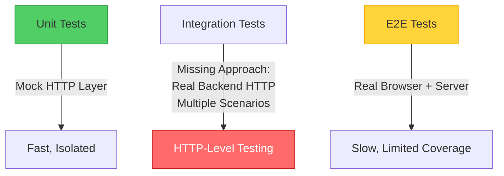
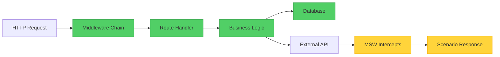

## Quick Navigation

**Choose your path based on what you need:**

| If you want to... | Go to... |
|-------------------|----------|
| Understand the testing gap Scenarist addresses | [HTTP Boundary Testing Gap](#the-http-boundary-testing-gap) |
| See framework-specific challenges (Next.js, Remix) | [Modern Framework Testing Challenges](#modern-framework-testing-challenges) |
| Understand how Scenarist works | [What Scenarist Provides](#what-scenarist-provides) |
| See concrete examples | [Example](#example) |
| Compare with unit/E2E tests | [Comparison](#comparison-with-other-testing-approaches) |
| Understand limitations and trade-offs | [Limitations](#limitations-and-trade-offs) |
| Start implementing | [Getting Started](#getting-started) |

---

## The HTTP Boundary Testing Gap

Modern web applications consist of frontend and backend code that communicate over HTTP. Testing these layers presents a challenge: unit tests test each side in isolation, while end-to-end tests test the full system including browser rendering.

Between these extremes lies a testing gap: **verifying that your backend HTTP layer (middleware, routing, request/response handling) behaves correctly under different scenarios**, without the overhead of full end-to-end tests.

### Modern Framework Testing Challenges

This gap is particularly evident with modern full-stack frameworks:

**Next.js Server Components** - The [official Next.js documentation](https://nextjs.org/docs/app/building-your-application/testing#async-server-components) states: *"Since async Server Components are new to the React ecosystem, Next.js recommends using end-to-end testing."* Unit testing requires mocking Next.js internals (fetch, cookies, headers), creating distance from production execution.

**Remix Loaders & Actions** - The [Remix documentation](https://remix.run/docs/en/main/discussion/testing) notes: *"There aren't standard ways of testing components that have Remix code."* Developers must test loaders and actions separately from components, then hope they integrate correctly.

**SvelteKit Server Routes** - Testing server-side logic requires either mocking the framework's request/response handling or running full end-to-end tests, with no standard middle ground.

:::note[The Pattern]
These frameworks shift more logic to the server, making the HTTP boundary increasingly important to test. Traditional unit tests can verify this logic, but require extensive mocking of framework internals. End-to-end tests provide confidence but are too slow for comprehensive scenario coverage.
:::

### Common Testing Approaches



**Unit tests** typically mock the HTTP layer entirely. This makes them fast and isolated, but creates distance from how your code actually runs when handling real HTTP requests. Testing middleware chains, routing logic, and request/response cycles requires recreating HTTP semantics in mocks.

**End-to-end tests** run the full system including a real browser and server. This provides confidence that everything works together, but the test execution time limits how many scenarios you can practically cover. Testing every edge case, error state, and user type becomes impractical.

**The gap**: Testing your backend's HTTP behavior (middleware execution, routing, request handling) with different scenarios, using real HTTP requests, without the overhead of browser automation for each test case.

## What Scenarist Provides

Scenarist fills this gap by enabling **HTTP-level integration testing** with **runtime scenario switching**:

- Tests make real HTTP requests to your backend
- Your backend code executes normally (middleware, routing, business logic)
- External API calls are intercepted and return scenario-defined responses
- Different scenarios run in parallel against the same server instance
- Each test is isolated via unique test identifiers

### Execution Model

When testing with Scenarist, your backend executes as it would in production:



**Green boxes**: Your code executes with production behavior
**Yellow boxes**: External API calls are intercepted and handled by scenario definitions

### Example

```typescript
// Define a scenario
const premiumUserScenario = {
  id: 'premiumUser',
  name: 'Premium User',
  mocks: [{
    method: 'GET',
    url: 'https://api.auth-provider.com/session',
    response: {
      status: 200,
      body: { tier: 'premium', userId: 'user-123' }
    }
  }]
};

// Test uses the scenario
test('premium users access advanced features', async ({ page, switchScenario }) => {
  await switchScenario(page, 'premiumUser');

  // This HTTP request goes to your real backend
  await page.goto('/dashboard');

  // Your middleware runs, your route handler executes,
  // external auth API call returns mocked premium tier,
  // your business logic processes the tier correctly

  await expect(page.getByText('Advanced Analytics')).toBeVisible();
});
```

## Comparison with Other Testing Approaches

| Aspect | Unit Tests | E2E Tests | Scenarist |
|--------|-----------|-----------|-----------|
| HTTP layer | Mocked | Real | Real |
| Backend execution | Real (but isolated) | Real | Real |
| External APIs | Mocked | Real or mocked | Mocked via scenarios |
| Parallel execution | Yes | Typically no | Yes |
| Speed | Fast | Slow | Fast |
| Scenario coverage | High (with mocking) | Low (speed constraint) | High |

None of these approaches replaces the others—they serve different purposes:

- **Unit tests** verify individual functions and modules in isolation
- **Scenarist** verifies HTTP-level behavior with different external API scenarios
- **E2E tests** verify the complete user experience including browser interactions

## Runtime Scenario Switching

Traditional end-to-end tests cannot switch external API behavior at runtime. Testing different scenarios (premium vs free users, error states) typically requires separate deployments, complex data setup, or conditional logic in application code.

Scenarist addresses this through runtime scenario switching using test identifiers:

```typescript
// Define multiple scenarios
const scenarios = {
  premium: { /* premium tier mocks */ },
  free: { /* free tier mocks */ },
  error: { /* error state mocks */ }
} as const satisfies ScenaristScenarios;

// Tests run concurrently
test('premium features', async ({ page, switchScenario }) => {
  await switchScenario(page, 'premium');
  // Test with premium scenario
});

test('free features', async ({ page, switchScenario }) => {
  await switchScenario(page, 'free');
  // Test with free scenario - runs simultaneously
});
```

Each test:
1. Gets a unique test identifier (generated automatically)
2. Switches to its required scenario by sending the test ID and scenario name
3. Makes requests that include its test ID in headers
4. Server routes requests to appropriate scenario based on test ID

This enables parallel test execution without process coordination or port conflicts.

### How Test Isolation Works

Scenarist adds control endpoints (like `/__scenario__`) during testing:

```typescript
// Behind the scenes when you call switchScenario()
POST /__scenario__
Headers: x-test-id: abc-123
Body: { scenario: 'premium' }

// Server maps: test-id abc-123 → premium scenario
// All requests with x-test-id: abc-123 use premium mocks
```

Different test IDs use different scenarios simultaneously without interference.

## Framework Independence

Scenarist uses hexagonal architecture to maintain framework independence. The core has no web framework dependencies.

Benefits:
- Scenario definitions work across all frameworks
- Framework-specific adapters handle integration (~100 lines each)
- Switching frameworks doesn't require rewriting scenarios

Supported frameworks: Express, Next.js (Pages and App Router), Fastify, and others.

[Learn about the architecture →](/concepts/architecture)

## Dynamic Response Capabilities

Scenarist supports three types of dynamic responses for realistic test scenarios:

### Request Content Matching

Return different responses based on request content:

```typescript
{
  method: 'POST',
  url: '/api/checkout',
  match: {
    body: { tier: 'premium' }
  },
  response: { status: 200, body: { discount: 20 } }
}
```

Multiple mocks can exist for the same URL. Scenarist selects the most specific match based on the actual request content.

### Response Sequences

Simulate multi-step processes like polling:

```typescript
{
  method: 'GET',
  url: '/api/job/status',
  sequence: {
    responses: [
      { status: 200, body: { status: 'pending' } },
      { status: 200, body: { status: 'processing' } },
      { status: 200, body: { status: 'complete' } }
    ],
    repeat: 'last'
  }
}
```

Each request advances through the sequence. The `repeat` option controls behavior after the sequence completes.

### Stateful Mocks

Capture data from requests and inject it into subsequent responses:

```typescript
{
  method: 'POST',
  url: '/api/cart/add',
  captureState: {
    cartItems: { from: 'body', path: 'productId' }
  },
  response: { status: 201 }
},
{
  method: 'GET',
  url: '/api/cart',
  response: {
    status: 200,
    body: { items: '{{state.cartItems}}' }
  }
}
```

State is isolated per test ID, ensuring parallel tests don't interfere with each other.

## When to Use Scenarist

Consider Scenarist when:

- Testing middleware chains, routing logic, or request/response handling
- Verifying backend behavior under different external API responses
- Testing scenarios where external APIs are slow, rate-limited, or expensive
- Running many test scenarios in parallel against the same server
- Testing modern frameworks (Next.js Server Components, Remix loaders) where unit testing requires complex framework mocking

Consider alternatives when:

- Testing individual functions in isolation (use unit tests)
- Verifying complete user workflows including browser interactions (use E2E tests)
- Validating integration with real third-party services (use E2E or integration tests with real services)
- Testing frontend-only applications with no backend HTTP layer
- Verifying API contracts match specifications (consider contract testing tools)

:::caution[Not a Replacement for E2E Testing]
Scenarist tests HTTP-level backend behavior, not complete user workflows. Browser interactions, JavaScript execution, visual rendering, and client-side state management still require end-to-end tests. Use Scenarist to complement E2E tests, not replace them.
:::

## Limitations and Trade-offs

**Single-server deployment**: Scenarist stores test ID to scenario mappings in memory. This works well for local development and single-instance CI environments. Load-balanced deployments would require additional state management.

**Mock maintenance**: Scenario definitions need updates when external APIs change. Scenarist doesn't validate that mocks match real API contracts—this is a deliberate trade-off for test isolation and speed.

**Learning curve**: Understanding scenario definitions, test ID isolation, and the relationship between mocks and real backend code requires initial investment. The documentation and examples aim to reduce this learning time.

**Not a replacement for E2E testing**: Scenarist tests backend HTTP behavior, not complete user workflows. Browser interactions, JavaScript execution, and visual verification still require E2E tests.

## Success Criteria

When evaluating whether Scenarist is working correctly in your project, verify:

**Core Functionality:**
- ✓ Tests run in parallel without interference
- ✓ Different scenarios can be active simultaneously (different test IDs)
- ✓ Scenario switching works at runtime (no server restarts required)
- ✓ Backend code executes with real middleware, routing, and business logic

**Integration Quality:**
- ✓ Only external API calls are mocked (not framework internals)
- ✓ Test isolation is maintained (parallel tests don't affect each other)
- ✓ Scenario definitions are reusable across different test suites
- ✓ Mock definitions accurately represent external API contracts

**Test Coverage:**
- ✓ Edge cases and error states can be tested without complex setup
- ✓ Multiple user types/tiers can be tested concurrently
- ✓ API rate limiting and retry logic can be verified
- ✓ Tests remain fast enough for frequent execution during development

**Common Issues to Watch:**
- ⚠ If tests interfere with each other → check test ID isolation
- ⚠ If framework internals are mocked → refactor to mock external APIs only
- ⚠ If scenarios can't switch at runtime → verify scenario registration
- ⚠ If tests are slow → consider if you're running full browser automation when HTTP-level testing would suffice

## Getting Started

Choose your framework to see specific installation and usage instructions:

- [Express →](/frameworks/express)
- [Next.js (Pages Router) →](/frameworks/nextjs-pages)
- [Next.js (App Router) →](/frameworks/nextjs-app)

Or explore core concepts that apply to all frameworks:

- [Scenarios & Mocks →](/core-concepts/scenarios)
- [Dynamic Responses →](/core-concepts/dynamic-responses)
- [Architecture →](/concepts/architecture)
