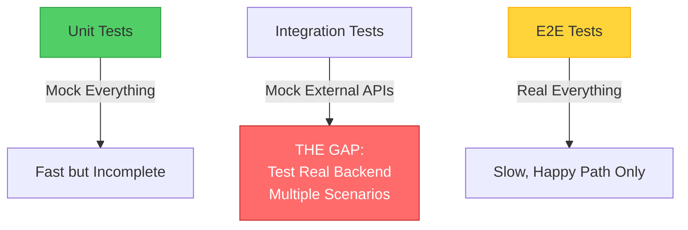
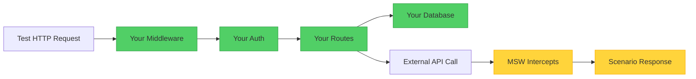

:::tip[TL;DR]
**The Problem:** Unit tests mock too much. Browser tests test too little. The gap: testing your real backend code (API routes, Server Components, middleware) through HTTP with different scenarios.

**Scenarist's Solution:** Define scenarios once, switch at runtime, test everything in parallel. Your entire backend executes—Next.js Server Components render, API routes process requests, middleware chains run—only external APIs are mocked.
:::

## The Testing Gap

Applications typically use three testing approaches:



**Unit tests** mock your database, external APIs, and HTTP layer. Fast, but testing your middleware, routing, and error handling together requires painful mocking—creating a gap between how you test and how code actually runs in production.

**E2E tests** use real servers and browsers. Production-like execution, but too slow for comprehensive scenario coverage—testing all edge cases and error scenarios is impractical.

**The gap:** You CAN test backend code (middleware, auth, routing, error handling) through HTTP in unit tests, but the extensive mocking required creates distance from production reality. You need production-like execution without the speed penalty or scenario limitations of E2E tests.

Scenarist fills this gap by letting you test your real backend with different external API scenarios, all in the same process.

## What Gets Tested

When you test with Scenarist, here's what actually executes:



**Green (Real Execution):** Your entire backend executes with production code:
- Next.js Server Components render with real data fetching
- API routes process requests through full middleware chains
- Express/Fastify/Hono routes execute with real validation and business logic
- Database queries run (or can be mocked separately if needed)

**Yellow (Mocked):** Only external API calls (Stripe, Auth0, SendGrid, etc.) are intercepted by MSW and return scenario-based responses.

### Quick Comparison

| Capability | Unit Tests | E2E Tests | **Scenarist** |
|------------|-----------|-----------|---------------|
| **Test middleware chains** | ⚠️ Painful mocking | ❌ Not isolated | ✅ Real execution |
| **Multiple scenarios** | ✅ With mocks | ⚠️ 1-2 only (slow) | ✅ Unlimited |
| **Speed** | ✅ Fast | ❌ Slow | ✅ Fast |
| **Parallel execution** | ✅ Yes | ⚠️ Usually no | ✅ Yes (perfect isolation) |
| **Production-like** | ❌ Mocks create gap | ✅ Real backend | ✅ Real backend |

## Runtime Scenario Switching

Instead of spawning different servers for different test scenarios, Scenarist switches scenarios at runtime using test IDs:

```typescript
// Define scenarios once
const scenarios = {
  premiumUser: {
    id: 'premiumUser',
    name: 'Premium User',
    mocks: [{
      method: 'GET',
      url: 'https://api.auth-provider.com/session',
      response: { status: 200, body: { tier: 'premium' } }
    }]
  },
  freeUser: {
    id: 'freeUser',
    name: 'Free User',
    mocks: [{
      method: 'GET',
      url: 'https://api.auth-provider.com/session',
      response: { status: 200, body: { tier: 'free' } }
    }]
  }
} as const satisfies ScenaristScenarios;

// Tests run in parallel, each with different scenario
test('premium users see advanced features', async ({ page, switchScenario }) => {
  await switchScenario(page, 'premiumUser');
  // Your full backend executes with premium tier mock
  await page.goto('/dashboard');
  await expect(page.getByText('Advanced Analytics')).toBeVisible();
});

test('free users see upgrade prompts', async ({ page, switchScenario }) => {
  await switchScenario(page, 'freeUser');
  // Same backend, different external API response
  await page.goto('/dashboard');
  await expect(page.getByText('Upgrade to Premium')).toBeVisible();
});
```

**Key Benefit:** All tests run in parallel against the same server. No port conflicts, no startup delays, no process coordination.

## Framework-Agnostic Architecture

Scenarist uses **hexagonal architecture** (ports and adapters) to maintain complete framework independence. The core package (`@scenarist/core`) has zero dependencies on any web framework—all scenario management, test isolation, and response selection logic is framework-agnostic.

**This means:**
- Define scenarios once, use with Express, Next.js, Remix, Fastify, or any framework
- Switching frameworks doesn't require rewriting test scenarios
- Thin adapters (~100 lines) handle framework-specific integration
- Core improvements benefit all frameworks immediately

[Learn how the architecture works internally →](/concepts/architecture)

## Dynamic Response Features

Scenarist supports three types of dynamic responses for realistic testing scenarios:

<details>
<summary><strong>1. Request Content Matching</strong> - Different responses based on request data</summary>

Return different responses based on request body, headers, or query parameters:

```typescript
{
  method: 'POST',
  url: '/api/checkout',
  match: {
    body: { tier: 'premium' },
    headers: { 'x-feature-flag': 'enabled' }
  },
  response: { status: 200, body: { discount: 20 } }
}
```

[Full documentation →](/core-concepts/dynamic-responses#request-matching)

</details>

<details>
<summary><strong>2. Response Sequences</strong> - Simulate polling, rate limiting, multi-step flows</summary>

Sequences return different responses on successive calls:

```typescript
{
  method: 'GET',
  url: '/api/job/status',
  sequence: {
    responses: [
      { status: 200, body: { status: 'pending' } },
      { status: 200, body: { status: 'processing' } },
      { status: 200, body: { status: 'complete' } }
    ],
    repeat: 'last'  // Keep returning 'complete' after sequence ends
  }
}
```

[Full documentation →](/core-concepts/dynamic-responses#sequences)

</details>

<details>
<summary><strong>3. Stateful Mocks</strong> - Capture data from requests, inject into responses</summary>

Capture data from POST requests and return it in GET requests:

```typescript
{
  method: 'POST',
  url: '/api/cart/add',
  captureState: { cartItems: { from: 'body', path: 'productId' } },
  response: { status: 201 }
},
{
  method: 'GET',
  url: '/api/cart',
  response: {
    status: 200,
    body: { items: '{{state.cartItems}}' }  // Injected from captured state
  }
}
```

[Full documentation →](/core-concepts/dynamic-responses#stateful-mocks)

</details>

## Real-World Example: Testing Premium Checkout

Here's a complete example testing a premium checkout flow with tier-based pricing. This works identically whether you're using **Express API routes**, **Next.js Server Components**, **Remix loaders**, or any other framework:

<details>
<summary><strong>Scenario Definition</strong> - Mock external APIs, not your code</summary>

```typescript
const premiumCheckoutScenario = {
  id: 'premiumCheckout',
  name: 'Premium User Checkout Flow',
  mocks: [
    // Mock EXTERNAL auth API (not your code)
    {
      method: 'GET',
      url: 'https://auth.provider.com/api/session',
      response: {
        status: 200,
        body: { userId: 'user-123', tier: 'premium' }
      }
    },
    // Mock EXTERNAL Stripe API (not your code)
    {
      method: 'POST',
      url: 'https://api.stripe.com/v1/charges',
      response: {
        status: 200,
        body: { id: 'ch_123', status: 'succeeded' }
      }
    }
  ]
};

const standardCheckoutScenario = {
  id: 'standardCheckout',
  name: 'Standard User Checkout Flow',
  mocks: [
    {
      method: 'GET',
      url: 'https://auth.provider.com/api/session',
      response: {
        status: 200,
        body: { userId: 'user-456', tier: 'standard' }
      }
    },
    // Same Stripe mock...
  ]
};
```

</details>

<details>
<summary><strong>Tests</strong> - All run in parallel, testing real backend code</summary>

```typescript
test('premium user sees 20% discount', async ({ page, switchScenario }) => {
  await switchScenario(page, 'premiumCheckout');

  await page.goto('/cart');

  // Your backend executes:
  // 1. Calls mocked auth API → gets tier: 'premium'
  // 2. YOUR pricing logic: price * 0.8
  // 3. YOUR API returns calculated discount
  // 4. Browser renders response

  await expect(page.getByText('$4,000.00')).toBeVisible(); // Was $5000
  await expect(page.getByText('Premium Discount')).toBeVisible();
});

test('standard user sees full price', async ({ page, switchScenario }) => {
  await switchScenario(page, 'standardCheckout');

  await page.goto('/cart');

  // Same backend, different tier → different price
  await expect(page.getByText('$5,000.00')).toBeVisible();
});

test('premium checkout succeeds at $5000', async ({ page, switchScenario }) => {
  await switchScenario(page, 'premiumCheckout');

  await page.goto('/checkout');
  await page.fill('[name="amount"]', '5000');
  await page.click('button[type="submit"]');

  // YOUR validation: 5000 <= 10000 (premium limit) ✓
  // Mocked Stripe API returns success
  // YOUR response handling

  await expect(page.getByText('Order confirmed')).toBeVisible();
});
```

[See full example →](https://github.com/citypaul/scenarist/tree/main/apps/express-example)

</details>

**What executes:** All your backend code runs with production logic:
- Next.js Server Components render with real data fetching
- API routes process requests (Express, Next.js, Remix, etc.)
- Middleware chains execute in order
- Validation and business logic run
- Database queries execute (or can be mocked separately)

**What's mocked:** Only external services (Auth, Stripe, SendGrid) you don't control.

## Trade-offs & When to Consider Alternatives

**Consider alternatives when:**

- **You need true E2E testing**: Scenarist mocks external APIs. If you need to verify integration with real third-party services, use full E2E tests.
- **Your app has no external dependencies**: If your backend doesn't call external APIs, Scenarist adds unnecessary complexity.
- **You're testing frontend-only apps**: Scenarist tests backend HTTP behavior. For frontend components, use React Testing Library or similar.
- **You need API contract testing**: Scenarist verifies your code handles responses correctly, but doesn't validate that mocks match real API contracts. Consider Pact for contract testing.

**Trade-offs to consider:**

- **Learning curve**: Understanding scenario definitions, test ID isolation, and MSW interception requires initial time investment.
- **Debugging complexity**: Failed tests require tracing through both your code and scenario definitions. MSW debug logging helps but adds setup.
- **Mock maintenance**: External APIs evolve, scenario definitions need updates. No automated contract validation.

## Practical Guidance

**Getting Started (15 minutes):**
1. Install adapter for your framework
2. Define simple scenario (single mock, static response)
3. Write first test using scenario
4. Add request matching when needed
5. Progress to sequences/state for complex flows

**Debugging Failed Tests:**
```typescript
// 1. Enable MSW request logging
server.events.on('request:start', ({ request }) => {
  console.log('[MSW]', request.method, request.url);
});

// 2. Check active scenario
const response = await page.request.get('http://localhost:3000/__scenario__');
console.log(await response.json()); // Shows current scenario for test ID

// 3. Verify test ID propagation
console.log(page.context().extraHTTPHeaders()); // Should include x-test-id
```

**Real-World Metrics:**
- Express example app: 49 tests run in 2.3s (parallel execution)
- Test isolation: 100% success rate with concurrent execution
- Setup time: ~15 minutes for new framework adapter

## Framework-Specific Benefits

:::note[Modern Framework Testing]
**Next.js Server Components**, **Remix loaders**, and **SvelteKit server routes** are notoriously hard to test in isolation. Unit tests require complex mocking of framework internals. E2E tests work but are too slow for comprehensive scenario coverage.

**Scenarist solves this:** Your Server Components render for real, loaders execute with actual data fetching, server routes process requests through full middleware chains. Only external API calls are mocked, not your framework code.
:::

## Getting Started

Choose your framework:

- [Express →](/frameworks/express)
- [Next.js (Pages Router) →](/frameworks/nextjs-pages)
- [Next.js (App Router) →](/frameworks/nextjs-app)

Or understand [core concepts →](/core-concepts/scenarios) that apply to all frameworks.
