## The HTTP Boundary Testing Gap

Modern web applications consist of frontend and backend code that communicate over HTTP. Testing these layers presents a challenge: unit tests test each side in isolation, while end-to-end tests test the full system including browser rendering.

Between these extremes lies a testing gap: **verifying that your backend HTTP layer (middleware, routing, request/response handling) behaves correctly under different scenarios**, without the overhead of full end-to-end tests.

## Quick Navigation

**Choose your path based on what you need:**

| If you want to... | Go to... |
|-------------------|----------|
| See framework-specific challenges (Next.js, Remix) | [Modern Framework Testing Challenges](#modern-framework-testing-challenges) |
| Understand how Scenarist works | [What Scenarist Provides](#what-scenarist-provides) |
| See concrete examples | [Example](#example) |
| Compare with unit/E2E tests | [Comparison](#comparison-with-other-testing-approaches) |
| Understand limitations and trade-offs | [Limitations](#limitations-and-trade-offs) |
| Start implementing | [Getting Started](#getting-started) |

---

### Modern Framework Testing Challenges

This gap is particularly evident with modern full-stack frameworks:

**Next.js Server Components** - The [official Next.js documentation](https://nextjs.org/docs/app/building-your-application/testing#async-server-components) states: *"Since async Server Components are new to the React ecosystem, Next.js recommends using end-to-end testing."* Unit testing requires mocking Next.js internals (fetch, cookies, headers), creating distance from production execution.

→ **Scenarist solves this** by testing Server Components with real HTTP requests to your Next.js routes. [See how →](/frameworks/nextjs)

**Remix Loaders & Actions** - The [Remix documentation](https://remix.run/docs/en/main/discussion/testing) notes: *"There aren't standard ways of testing components that have Remix code."* Developers must test loaders and actions separately from components, then hope they integrate correctly.

→ **Scenarist solves this** by testing loaders and actions at the HTTP layer where they naturally integrate. [See how →](/frameworks/remix)

**SvelteKit Server Routes** - Testing server-side logic requires either mocking the framework's request/response handling or running full end-to-end tests, with no standard middle ground.

→ **Scenarist solves this** by providing HTTP-level testing without browser overhead. [See how →](/frameworks/sveltekit)

:::note[The Pattern]
These frameworks shift more logic to the server, making the HTTP boundary increasingly important to test. Traditional unit tests can verify this logic, but require extensive mocking of framework internals. End-to-end tests provide confidence but are too slow for comprehensive scenario coverage.

**Scenarist addresses all these challenges** by testing at the HTTP boundary with real backend execution and mocked external APIs.
:::

### How Scenarist Works: One Server, Unlimited Scenarios

```mermaid
%%{init: {'theme':'neutral', 'themeVariables': {'fontSize':'14px', 'fontFamily':'arial'}}}%%
graph LR
    subgraph tests[" "]
        direction TB
        T1["Test 1: Happy path<br/><br/>switchScenario('allSucceed')"]
        T2["Test 2: Payment error<br/><br/>switchScenario('paymentFails')"]
        T3["Test 3: Auth error<br/><br/>switchScenario('authFails')"]
        T4["Test 4: Email failure<br/><br/>switchScenario('emailFails')"]
    end

    B["🟢 Your Real Backend<br/>(HTTP + Middleware + Business Logic)"]

    subgraph scenario1["Scenario: allSucceed"]
        direction TB
        S1A["💳 Stripe<br/>status: 'succeeded'<br/>amount: 5000"]
        S1B["🔐 Auth0<br/>user: 'john@example.com'<br/>tier: 'premium'"]
        S1C["📧 SendGrid<br/>status: 'sent'<br/>messageId: 'abc123'"]
    end

    subgraph scenario2["Scenario: paymentFails"]
        direction TB
        S2A["💳 Stripe<br/>status: 'declined'<br/>code: 'card_declined'"]
        S2B["🔐 Auth0<br/>user: 'john@example.com'<br/>tier: 'premium'"]
        S2C["📧 SendGrid<br/>status: 'sent'<br/>messageId: 'def456'"]
    end

    subgraph scenario3["Scenario: authFails"]
        direction TB
        S3A["💳 Stripe<br/>status: 'succeeded'<br/>amount: 5000"]
        S3B["🔐 Auth0<br/>status: 401<br/>error: 'invalid_grant'"]
        S3C["📧 SendGrid<br/>status: 'sent'<br/>messageId: 'ghi789'"]
    end

    subgraph scenario4["Scenario: emailFails"]
        direction TB
        S4A["💳 Stripe<br/>status: 'succeeded'<br/>amount: 5000"]
        S4B["🔐 Auth0<br/>user: 'john@example.com'<br/>tier: 'premium'"]
        S4C["📧 SendGrid<br/>status: 500<br/>error: 'service_unavailable'"]
    end

    T1 -->|"switchScenario('allSucceed')"<br/>then real HTTP requests| B
    T2 -->|"switchScenario('paymentFails')"<br/>then real HTTP requests| B
    T3 -->|"switchScenario('authFails')"<br/>then real HTTP requests| B
    T4 -->|"switchScenario('emailFails')"<br/>then real HTTP requests| B

    B -.->|Routes to<br/>scenario| scenario1
    B -.->|Routes to<br/>scenario| scenario2
    B -.->|Routes to<br/>scenario| scenario3
    B -.->|Routes to<br/>scenario| scenario4

    style tests fill:#f1f3f5,stroke:#868e96,stroke-width:2px
    style B fill:#51cf66,stroke:#2f9e44,stroke-width:4px
    style scenario1 fill:#d3f9d8,stroke:#2f9e44,stroke-width:2px
    style scenario2 fill:#fff3bf,stroke:#fab005,stroke-width:2px
    style scenario3 fill:#ffe3e3,stroke:#fa5252,stroke-width:2px
    style scenario4 fill:#ffe3e3,stroke:#fa5252,stroke-width:2px
    style T1 fill:#e7f5ff,stroke:#1971c2
    style T2 fill:#e7f5ff,stroke:#1971c2
    style T3 fill:#e7f5ff,stroke:#1971c2
    style T4 fill:#e7f5ff,stroke:#1971c2
```



**The key insight:** Each scenario is a **complete set of API mocks**. One scenario controls what Stripe returns AND what Auth0 returns AND what SendGrid returns—all coordinated for that test case.

**What this means:**
- ✅ **One scenario = All API responses** - "Payment Fails" scenario: Stripe declines card, but Auth0 still succeeds, SendGrid still sends
- ✅ **Test edge cases exhaustively** - Can't test "payment succeeds but email fails" with real APIs (you'd need to break SendGrid intentionally)
- ✅ **Real backend execution** - Your code handles the declined card, processes the error, logs appropriately—all tested
- ✅ **Fast parallel testing** - All 4 tests run simultaneously, each with different external API behavior
- ✅ **Test scenarios impossible in production** - Auth failures, API timeouts, network errors, edge cases

**Why E2E tests can't do this:**
- **Too slow** - Testing 100 scenarios with real Stripe + Auth0 + SendGrid would take hours
- **Can't reach all states** - How do you make Stripe succeed but SendGrid fail? Or Auth0 timeout? Or get a specific error code?
- **Not deterministic** - Real APIs change, tests become flaky

**Example scenario names explained:**
When we say "Premium User Scenario" in the docs, we mean: *a scenario where Auth0 returns `{tier: "premium"}` and Stripe returns successful payment responses*. It's shorthand for "the complete set of API mocks that simulate a premium user experience."

## What Scenarist Provides

Scenarist fills this gap by enabling **HTTP-level integration testing** with **runtime scenario switching**:

- Tests make real HTTP requests to your backend
- Your backend code executes normally (middleware, routing, business logic)
- External API calls are intercepted and return scenario-defined responses
- Different scenarios run in parallel against the same server instance
- Each test is isolated via unique test identifiers

### Execution Model

When testing with Scenarist, your backend executes as it would in production:


**Green boxes**: Your code executes with production behavior
**Yellow boxes**: External API calls are intercepted and handled by scenario definitions

### Example

This example demonstrates HTTP-level testing with Next.js. Each framework has its own adapter that integrates Scenarist into your application.

**Step 1: Framework-specific setup** (done once per application)

```typescript
// app/api/[[...route]]/route.ts - Next.js App Router
import { createScenarist } from '@scenarist/nextjs-adapter';
import { scenarios } from './scenarios';

export const { GET, POST } = createScenarist({
  enabled: process.env.NODE_ENV === 'test',
  scenarios,
});
```

**Step 2: Define scenarios** (reusable across tests)

```typescript
// scenarios.ts
export const scenarios = {
  premiumUser: {
    id: 'premiumUser',
    name: 'Premium User',
    mocks: [{
      method: 'GET',
      url: 'https://api.auth-provider.com/session',
      response: {
        status: 200,
        body: { tier: 'premium', userId: 'user-123' }
      }
    }]
  }
} as const;
```

**Step 3: Write tests** (framework-agnostic)

```typescript
// tests/premium-features.spec.ts
import { test, expect } from '@playwright/test';

test('premium users access advanced features', async ({ page, switchScenario }) => {
  await switchScenario(page, 'premiumUser');

  // Real HTTP request → Next.js route → middleware → business logic
  await page.goto('/dashboard');

  // External auth API call intercepted, returns mocked premium tier
  // Your business logic processes the tier correctly
  await expect(page.getByText('Advanced Analytics')).toBeVisible();
});
```

**What's happening:**
1. Framework adapter integrates Scenarist into your Next.js app
2. Scenario defines how external APIs behave
3. Test switches to scenario and makes real HTTP requests
4. Your backend code executes with production behavior
5. External API calls return scenario-defined responses

**See complete working examples:**
- [Next.js Example App →](/frameworks/nextjs/example-app) - Full Next.js App Router application with installation instructions
- [Express Example App →](/frameworks/express/example-app) - Complete Express application with comprehensive tests

**Framework-specific guides:**
- [Next.js setup →](/frameworks/nextjs) - Server Components, API routes, Server Actions
- [Express setup →](/frameworks/express) - Middleware, route handlers
- [Remix setup →](/frameworks/remix) - Loaders, actions (coming soon)
- [SvelteKit setup →](/frameworks/sveltekit) - Server routes (coming soon)

## Comparison with Other Testing Approaches

| Aspect | Unit Tests | E2E Tests | Scenarist |
|--------|-----------|-----------|-----------|
| HTTP layer | Mocked | Real | Real |
| Backend execution | Real (but isolated) | Real | Real |
| External APIs | Mocked | Real or mocked | Mocked via scenarios |
| Parallel execution | Yes | Typically no | Yes |
| Speed | Fast | Slow | Fast |
| Scenario coverage | High (with mocking) | Low (speed constraint) | High |

None of these approaches replaces the others—they serve different purposes:

- **Unit tests** verify individual functions and modules in isolation
- **Scenarist** verifies HTTP-level behavior with different external API scenarios
- **E2E tests** verify the complete user experience including browser interactions

## Runtime Scenario Switching

Traditional end-to-end tests cannot switch external API behavior at runtime. Testing different scenarios (premium vs free users, error states) typically requires separate deployments, complex data setup, or conditional logic in application code.

Scenarist addresses this through runtime scenario switching using test identifiers:

```typescript
// Define multiple scenarios
const scenarios = {
  premium: { /* premium tier mocks */ },
  free: { /* free tier mocks */ },
  error: { /* error state mocks */ }
} as const satisfies ScenaristScenarios;

// Tests run concurrently
test('premium features', async ({ page, switchScenario }) => {
  await switchScenario(page, 'premium');
  // Test with premium scenario
});

test('free features', async ({ page, switchScenario }) => {
  await switchScenario(page, 'free');
  // Test with free scenario - runs simultaneously
});
```

### How Test Isolation Works: Complete Request Flow

Here's how two tests run in parallel with different scenarios, showing the complete journey from scenario setup through multiple requests:

```mermaid
sequenceDiagram
    participant T1 as Test 1: Premium User<br/>(test-id: abc-123)
    participant T2 as Test 2: Free User<br/>(test-id: xyz-789)
    participant Server as Your Backend<br/>(One server, handles both tests)
    participant Scenarist as Scenarist<br/>(Routes by test-id)
    participant Stripe as Mocked Stripe API
    participant Auth as Mocked Auth0 API

    Note over T1,Auth: Tests run in parallel, each with different scenario

    rect rgb(220, 240, 255)
        Note over T1,Scenarist: Test 1: Set up Premium scenario
        T1->>+Scenarist: POST /__scenario__<br/>Headers: x-test-id: abc-123<br/>Body: { scenario: "premium" }
        Scenarist-->>-T1: ✓ Scenario active for abc-123
    end

    rect rgb(255, 240, 220)
        Note over T2,Scenarist: Test 2: Set up Free scenario (simultaneous!)
        T2->>+Scenarist: POST /__scenario__<br/>Headers: x-test-id: xyz-789<br/>Body: { scenario: "free" }
        Scenarist-->>-T2: ✓ Scenario active for xyz-789
    end

    rect rgb(220, 240, 255)
        Note over T1,Auth: Test 1: Complete journey uses Premium scenario
        T1->>+Server: GET /dashboard<br/>Headers: x-test-id: abc-123
        Server->>+Auth: Check user tier
        Scenarist->>Auth: Routes to Premium scenario<br/>(test-id: abc-123)
        Auth-->>-Server: { tier: "premium" }
        Server-->>-T1: Shows premium features ✓

        T1->>+Server: POST /checkout<br/>Headers: x-test-id: abc-123
        Server->>+Stripe: Process payment
        Scenarist->>Stripe: Routes to Premium scenario<br/>(test-id: abc-123)
        Stripe-->>-Server: { status: "success" }
        Server-->>-T1: Order confirmed ✓
    end

    rect rgb(255, 240, 220)
        Note over T2,Auth: Test 2: Complete journey uses Free scenario
        T2->>+Server: GET /dashboard<br/>Headers: x-test-id: xyz-789
        Server->>+Auth: Check user tier
        Scenarist->>Auth: Routes to Free scenario<br/>(test-id: xyz-789)
        Auth-->>-Server: { tier: "free" }
        Server-->>-T2: Shows limited features ✓

        T2->>+Server: POST /upgrade<br/>Headers: x-test-id: xyz-789
        Server-->>-T2: Upgrade page ✓
    end

    Note over T1,T2: Both tests complete successfully<br/>No interference despite running simultaneously
```



**The test isolation mechanism:**

1. **Each test gets a unique ID** (generated automatically)
2. **Test switches scenario once** via `POST /__scenario__` with its test ID
3. **All subsequent requests** include the test ID in headers (`x-test-id: abc-123`)
4. **Scenarist routes based on test ID** - same URL, different responses per test
5. **Scenario persists** for the entire test journey (dashboard → checkout → confirmation)
6. **Tests run in parallel** - Test 1 and Test 2 execute simultaneously without affecting each other

This enables:
- ✅ **Unlimited scenarios** - Test premium, free, errors, edge cases all in parallel
- ✅ **No interference** - Each test isolated by unique test ID
- ✅ **One backend server** - All tests share same server instance
- ✅ **Real HTTP execution** - Your middleware, routing, and logic run normally
- ✅ **Fast execution** - No expensive external API calls

This enables parallel test execution without process coordination or port conflicts.

## Framework Independence

Scenarist uses hexagonal architecture to maintain framework independence. The core has no web framework dependencies.

Benefits:
- Scenario definitions work across all frameworks
- Framework-specific adapters handle integration (~100 lines each)
- Switching frameworks doesn't require rewriting scenarios

Supported frameworks: Express, Next.js (Pages and App Router), Fastify, and others.

[Learn about the architecture →](/concepts/architecture)

## Dynamic Response Capabilities

Scenarist supports three types of dynamic responses for realistic test scenarios:

### Request Content Matching

Return different responses based on request content:

```typescript
{
  method: 'POST',
  url: '/api/checkout',
  match: {
    body: { tier: 'premium' }
  },
  response: { status: 200, body: { discount: 20 } }
}
```

Multiple mocks can exist for the same URL. Scenarist selects the most specific match based on the actual request content.

### Response Sequences

Simulate multi-step processes like polling:

```typescript
{
  method: 'GET',
  url: '/api/job/status',
  sequence: {
    responses: [
      { status: 200, body: { status: 'pending' } },
      { status: 200, body: { status: 'processing' } },
      { status: 200, body: { status: 'complete' } }
    ],
    repeat: 'last'
  }
}
```

Each request advances through the sequence. The `repeat` option controls behavior after the sequence completes.

### Stateful Mocks

Capture data from requests and inject it into subsequent responses:

```typescript
{
  method: 'POST',
  url: '/api/cart/add',
  captureState: {
    cartItems: { from: 'body', path: 'productId' }
  },
  response: { status: 201 }
},
{
  method: 'GET',
  url: '/api/cart',
  response: {
    status: 200,
    body: { items: '{{state.cartItems}}' }
  }
}
```

State is isolated per test ID, ensuring parallel tests don't interfere with each other.

## When to Use Scenarist

Consider Scenarist when:

- Testing middleware chains, routing logic, or request/response handling
- Verifying backend behavior under different external API responses
- Testing scenarios where external APIs are slow, rate-limited, or expensive
- Running many test scenarios in parallel against the same server
- Testing modern frameworks (Next.js Server Components, Remix loaders) where unit testing requires complex framework mocking

Consider alternatives when:

- Testing individual functions in isolation (use unit tests)
- Verifying complete user workflows including browser interactions (use E2E tests)
- Validating integration with real third-party services (use E2E or integration tests with real services)
- Testing frontend-only applications with no backend HTTP layer
- Verifying API contracts match specifications (consider contract testing tools)

:::caution[Not a Replacement for E2E Testing]
Scenarist tests HTTP-level backend behavior, not complete user workflows. Browser interactions, JavaScript execution, visual rendering, and client-side state management still require end-to-end tests. Use Scenarist to complement E2E tests, not replace them.
:::

## Limitations and Trade-offs

**Single-server deployment**: Scenarist stores test ID to scenario mappings in memory. This works well for local development and single-instance CI environments. Load-balanced deployments would require additional state management.

**Mock maintenance**: Scenario definitions need updates when external APIs change. Scenarist doesn't validate that mocks match real API contracts—this is a deliberate trade-off for test isolation and speed.

**Learning curve**: Understanding scenario definitions, test ID isolation, and the relationship between mocks and real backend code requires initial investment. The documentation and examples aim to reduce this learning time.

**Not a replacement for E2E testing**: Scenarist tests backend HTTP behavior, not complete user workflows. Browser interactions, JavaScript execution, and visual verification still require E2E tests.

## Success Criteria

When evaluating whether Scenarist is working correctly in your project, verify:

**Core Functionality:**
- ✓ Tests run in parallel without interference
- ✓ Different scenarios can be active simultaneously (different test IDs)
- ✓ Scenario switching works at runtime (no server restarts required)
- ✓ Backend code executes with real middleware, routing, and business logic

**Integration Quality:**
- ✓ Only external API calls are mocked (not framework internals)
- ✓ Test isolation is maintained (parallel tests don't affect each other)
- ✓ Scenario definitions are reusable across different test suites
- ✓ Mock definitions accurately represent external API contracts

**Test Coverage:**
- ✓ Edge cases and error states can be tested without complex setup
- ✓ Multiple user types/tiers can be tested concurrently
- ✓ API rate limiting and retry logic can be verified
- ✓ Tests remain fast enough for frequent execution during development

**Common Issues to Watch:**
- ⚠ If tests interfere with each other → check test ID isolation
- ⚠ If framework internals are mocked → refactor to mock external APIs only
- ⚠ If scenarios can't switch at runtime → verify scenario registration
- ⚠ If tests are slow → consider if you're running full browser automation when HTTP-level testing would suffice

## Getting Started

Choose your framework to see specific installation and usage instructions:

- [Next.js →](/frameworks/nextjs) - Test Server Components and API routes
- [Express →](/frameworks/express) - Test middleware and route handlers
- [Remix →](/frameworks/remix) - Test loaders and actions (coming soon)
- [SvelteKit →](/frameworks/sveltekit) - Test server routes (coming soon)

Or explore core concepts that apply to all frameworks:

- [Scenarios & Mocks →](/core-concepts/scenarios)
- [Dynamic Responses →](/core-concepts/dynamic-responses)
- [Architecture →](/concepts/architecture)
