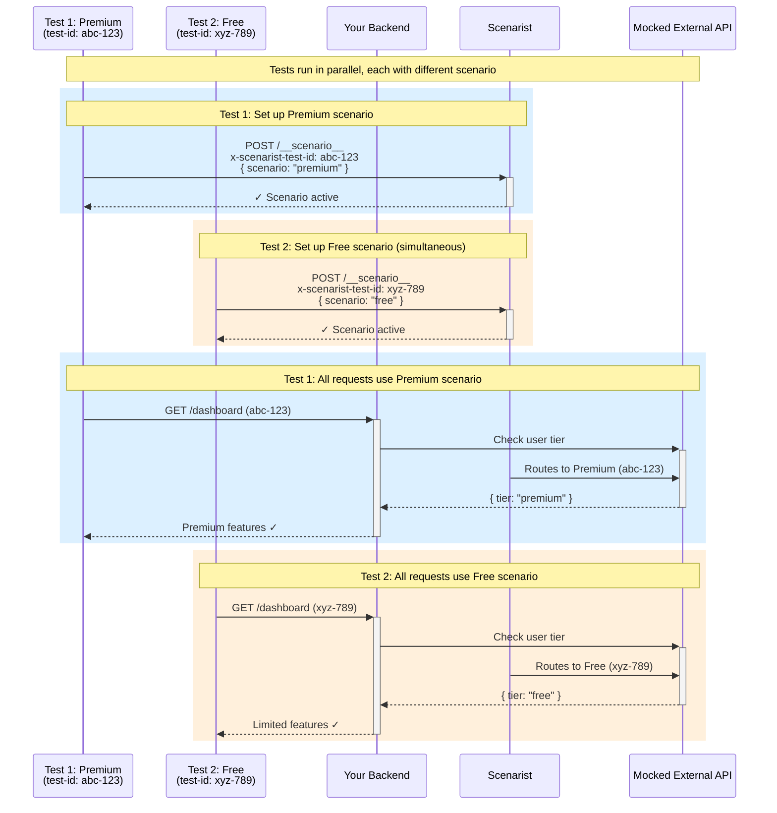

import { Aside } from '@astrojs/starlight/components';

Scenarist enables **parallel test execution** where multiple tests run simultaneously, each with their own scenario. This is achieved through **test ID isolation** - every test gets a unique identifier that determines which scenario's responses it receives.

## How Test Isolation Works

Each test gets a unique test ID (automatically generated by the Playwright fixture). This test ID is sent with every request, allowing Scenarist to route each test to its own scenario.

```typescript
// Two tests running in parallel, each with different scenarios
test('premium features', async ({ page, switchScenario }) => {
  await switchScenario(page, 'premium');  // test-id: abc-123 → premium scenario
  await page.goto('/dashboard');
  await expect(page.getByText('Advanced Analytics')).toBeVisible();
});

test('free features', async ({ page, switchScenario }) => {
  await switchScenario(page, 'free');     // test-id: xyz-789 → free scenario
  await page.goto('/dashboard');
  await expect(page.getByText('Upgrade to Premium')).toBeVisible();
});
// Both tests run simultaneously without interference
```

### Complete Request Flow

Here's how two tests run in parallel with different scenarios:



**The isolation mechanism:**

1. **Each test gets a unique ID** - Generated automatically by the fixture
2. **Test switches scenario once** - `POST /__scenario__` with test ID
3. **All subsequent requests** include the test ID header
4. **Scenarist routes by test ID** - Same URL, different responses per test
5. **Scenario persists** for the entire test journey

This enables:
- ✅ **Unlimited scenarios** - Premium, free, error, edge cases all in parallel
- ✅ **No interference** - Each test isolated by unique test ID
- ✅ **One backend server** - All tests share same server instance
- ✅ **Fast execution** - No expensive external API calls

## Header Propagation (Critical for Parallel Tests)

<Aside type="caution" title="Most Common Parallel Test Issue">
When tests fail in parallel but pass sequentially, the root cause is almost always **test ID headers not being propagated** through server-side fetch calls.
</Aside>

### The Problem

When your server-side code makes internal fetch calls (e.g., Server Components fetching from API routes), headers don't automatically propagate:

```typescript
// ❌ BAD - Headers not propagated to internal fetch
export async function Page() {
  // This fetch doesn't include the test ID header!
  const response = await fetch('http://localhost:3001/api/products');
  const data = await response.json();
  return <div>{/* render */}</div>;
}
```

Without the test ID header, the internal fetch uses the **default scenario** instead of the test's scenario. In parallel tests, this causes interference.

### Next.js Solution: getScenaristHeaders()

```typescript
import { getScenaristHeaders } from '@scenarist/nextjs-adapter/app';

// ✅ GOOD - Headers propagated correctly
export async function Page() {
  const headers = getScenaristHeaders();  // Get headers from request context

  const response = await fetch('http://localhost:3001/api/products', {
    headers,  // Include test ID header
  });

  const data = await response.json();
  return <div>{/* render */}</div>;
}
```

**What `getScenaristHeaders()` does:**
- Extracts test ID from current request context (AsyncLocalStorage)
- Returns `{ 'x-scenarist-test-id': 'generated-uuid' }` object
- Safe to call when Scenarist is disabled (returns empty object)
- Works in both App Router and Pages Router

### Express Solution: Manual Header Forwarding

Express adapter uses AsyncLocalStorage to automatically track test IDs per request. For internal fetch calls, include the header manually:

```typescript
import { SCENARIST_TEST_ID_HEADER } from '@scenarist/express-adapter';

app.get('/api/dashboard', async (req, res) => {
  const testId = req.get(SCENARIST_TEST_ID_HEADER);

  const response = await fetch('http://localhost:3001/api/user', {
    headers: {
      [SCENARIST_TEST_ID_HEADER]: testId || '',
    },
  });

  const data = await response.json();
  res.json(data);
});
```

## Diagnosing Parallel Test Failures

### Symptoms of Missing Header Propagation

**Tests pass individually, fail in parallel:**
```bash
# Pass individually
pnpm exec playwright test --workers=1
# ✅ All tests pass

# Fail in parallel
pnpm exec playwright test --workers=4
# ❌ Some tests fail with wrong data
```

**Wrong data appearing in tests:**
```typescript
// Test expects premium pricing
await expect(page.getByText('£99.99')).toBeVisible();
// ❌ Error: element not found

// But sees standard pricing instead (from default scenario)
await expect(page.getByText('£149.99')).toBeVisible();
// ✅ This passes - wrong scenario!
```

**Flaky results:**
- Sometimes premium pricing, sometimes standard
- Different results on different runs
- Race conditions between parallel tests

### Debugging Steps

1. **Add logging** to see which scenario is active:
   ```typescript
   console.log('Test ID:', req.get('x-scenarist-test-id'));
   console.log('Active scenario:', scenarioManager.getActive(testId));
   ```

2. **Check server logs** for test ID headers on internal fetches

3. **Verify `getScenaristHeaders()`** is called before every internal fetch

4. **Confirm headers object** includes the test ID

### Fix Checklist

When parallel tests fail:

1. ✅ **Next.js:** Add `getScenaristHeaders()` before all internal fetch calls
2. ✅ **Express:** Include test ID header in internal fetch calls
3. ✅ **Playwright:** Verify tests call `switchScenario()` before navigation
4. ✅ **Isolation:** Ensure each test switches scenarios independently
5. ✅ **Logging:** Add debug logs to confirm headers are present

## Parallel Test Patterns

### Pattern 1: Independent Scenario Tests

Each test operates with its own scenario, no shared state:

```typescript
import { test, expect } from './fixtures';

test.describe('User tiers', () => {
  test('premium users see analytics', async ({ page, switchScenario }) => {
    await switchScenario(page, 'premium');
    await page.goto('/dashboard');
    await expect(page.getByText('Analytics')).toBeVisible();
  });

  test('free users see upgrade prompt', async ({ page, switchScenario }) => {
    await switchScenario(page, 'free');
    await page.goto('/dashboard');
    await expect(page.getByText('Upgrade')).toBeVisible();
  });

  test('enterprise users see admin panel', async ({ page, switchScenario }) => {
    await switchScenario(page, 'enterprise');
    await page.goto('/dashboard');
    await expect(page.getByText('Admin Panel')).toBeVisible();
  });
});
// All three tests run in parallel
```

### Pattern 2: Error Scenario Matrix

Test multiple error conditions in parallel:

```typescript
test.describe('Payment errors', () => {
  test('handles card declined', async ({ page, switchScenario }) => {
    await switchScenario(page, 'cardDeclined');
    await page.goto('/checkout');
    await page.click('button[type="submit"]');
    await expect(page.getByText('Card was declined')).toBeVisible();
  });

  test('handles insufficient funds', async ({ page, switchScenario }) => {
    await switchScenario(page, 'insufficientFunds');
    await page.goto('/checkout');
    await page.click('button[type="submit"]');
    await expect(page.getByText('Insufficient funds')).toBeVisible();
  });

  test('handles network timeout', async ({ page, switchScenario }) => {
    await switchScenario(page, 'stripeTimeout');
    await page.goto('/checkout');
    await page.click('button[type="submit"]');
    await expect(page.getByText('Please try again')).toBeVisible();
  });
});
```

### Pattern 3: Multi-Step Journeys

Each test covers a complete user journey with its scenario:

```typescript
test('complete checkout flow - premium user', async ({ page, switchScenario }) => {
  await switchScenario(page, 'premium');

  // Step 1: Browse products
  await page.goto('/products');
  await expect(page.getByText('Premium Discount: 20%')).toBeVisible();

  // Step 2: Add to cart
  await page.click('button:has-text("Add to Cart")');
  await expect(page.getByText('Cart: 1 item')).toBeVisible();

  // Step 3: Checkout
  await page.goto('/checkout');
  await expect(page.getByText('Total: £79.99')).toBeVisible(); // Discounted

  // Step 4: Payment
  await page.click('button:has-text("Pay Now")');
  await expect(page.getByText('Order Confirmed')).toBeVisible();
});

test('complete checkout flow - standard user', async ({ page, switchScenario }) => {
  await switchScenario(page, 'standard');

  // Same journey, different scenario - runs in parallel
  await page.goto('/products');
  await expect(page.getByText('Premium Discount: 20%')).not.toBeVisible();

  await page.click('button:has-text("Add to Cart")');
  await page.goto('/checkout');
  await expect(page.getByText('Total: £99.99')).toBeVisible(); // Full price

  await page.click('button:has-text("Pay Now")');
  await expect(page.getByText('Order Confirmed')).toBeVisible();
});
```

## Playwright Configuration

For optimal parallel test execution:

```typescript
// playwright.config.ts
import { defineConfig } from '@playwright/test';
import type { ScenaristOptions } from '@scenarist/playwright-helpers';

export default defineConfig<ScenaristOptions>({
  // Run tests in parallel
  fullyParallel: true,

  // Number of parallel workers
  workers: process.env.CI ? 4 : undefined,  // 4 in CI, auto-detect locally

  // Scenarist configuration
  use: {
    baseURL: 'http://localhost:3000',
    scenaristEndpoint: '/api/__scenario__',
  },
});
```

## Next Steps

- [Playwright Integration](/testing/playwright-integration) - Fixture setup and configuration
- [Testing Best Practices](/testing/best-practices) - Scenario organization patterns
- [Verification Guide](/reference/verification) - Troubleshooting test issues
