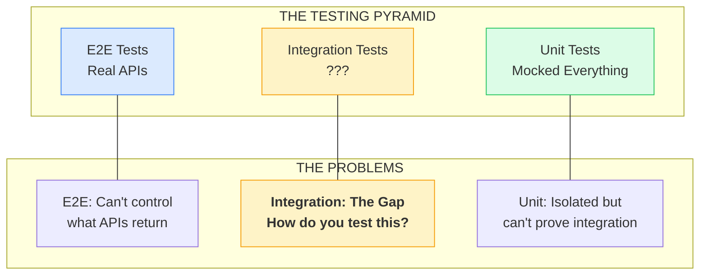
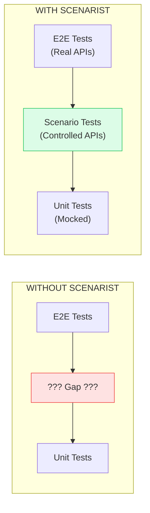
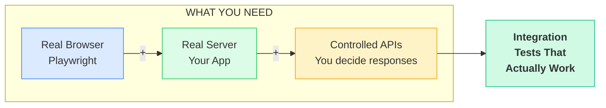

# Testing Pyramid with Gap

Shows the traditional testing pyramid and where the gap exists that Scenarist fills.

**When to show:** Video 1, "What You Actually Need" section (3:15-4:00)

**What to say:**

> "The testing pyramid has a gap. Unit tests at the bottom - fast, isolated, but shallow. E2E tests at the top - realistic, but you can't control the external APIs. What you need is something in between."

## Diagram (Mermaid)



## ASCII Version (for slides)

```
┌─────────────────────────────────────────────────────────────────────────────┐
│                    THE TESTING PYRAMID + THE GAP                             │
├─────────────────────────────────────────────────────────────────────────────┤
│                                                                              │
│                                  ▲                                           │
│                                 / \                                          │
│                                /   \                                         │
│                               /     \      E2E TESTS                         │
│                              / Real  \     • Real APIs (slow, expensive)     │
│                             /  APIs   \    • Can't control edge cases        │
│                            /───────────\   • Few scenarios possible          │
│                           /             \                                    │
│               ┌──────────/───────────────\──────────┐                       │
│               │    ░░░░░░░ THE GAP ░░░░░░░░░░░    │                       │
│               │                                    │                       │
│               │    Real browser + Real server +    │                       │
│               │    Controlled external APIs        │                       │
│               │                                    │                       │
│               │    SCENARIST FILLS THIS GAP       │                       │
│               │                                    │                       │
│               └────────────────────────────────────┘                       │
│                          /               \                                   │
│                         /                 \                                  │
│                        /   INTEGRATION     \                                 │
│                       /      TESTS          \                                │
│                      /───────────────────────\                               │
│                     /                         \                              │
│                    /        UNIT TESTS         \                             │
│                   /   • Mocked everything       \                            │
│                  /    • Fast but shallow         \                           │
│                 /     • Isolated from reality     \                          │
│                ─────────────────────────────────────                         │
│                                                                              │
└─────────────────────────────────────────────────────────────────────────────┘
```

## Alternative: Side-by-Side Comparison



## The Three Requirements

Show these as a checklist or bullet points:

```
What you need to fill the gap:

  ✓ Real browser (Playwright/Cypress)
    → Not jsdom - actual browser that users see

  ✓ Real server (your actual code)
    → Not mocked endpoints - your Next.js/Express app

  ✓ Controlled external APIs
    → You define what Auth0/Stripe/services return
    → Switch scenarios without restart
    → Isolated state per test
```

## Mermaid: What You Need



## Key Points

- Traditional pyramid has a gap between unit tests and E2E
- Unit tests: fast but can't prove integration
- E2E tests: realistic but can't control external APIs
- The gap needs: real browser + real server + controlled APIs
- "SCENARIST FILLS THIS GAP" - the key positioning message
- Don't oversell in Video 1 - just establish the problem and requirements
