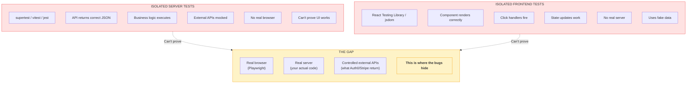
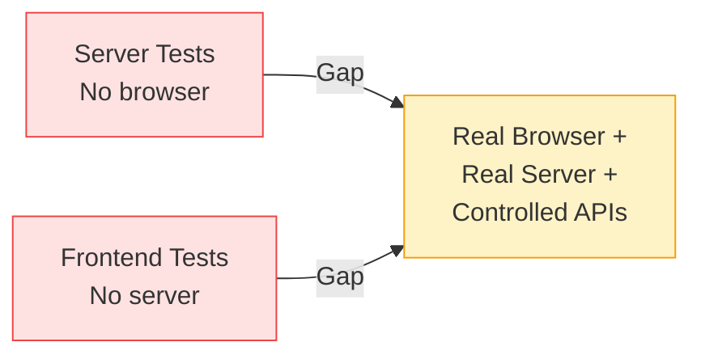

# The Real Testing Gap

The core diagram showing isolated tests vs the gap where real integration testing lives.

**When to show:** Video 1, "The Gap" section (2:00-2:30)

**What to say:**

> "This is the gap nobody talks about. On one side: isolated server tests. Supertest, Jest, Vitest. They prove your API returns the right JSON. But there's no browser. No real UI. On the other side: isolated frontend tests. React Testing Library, jsdom. They prove your components render. But there's no server. No real data. In the middle? The gap. Where you need a real browser, talking to a real server, with controlled external API responses. That's where the bugs hide."

## Diagram (Mermaid)



## ASCII Version (for slides)

```
┌─────────────────────────────────────────────────────────────────────────────┐
│                           THE REAL TESTING GAP                               │
├─────────────────────────────────────────────────────────────────────────────┤
│                                                                              │
│  ISOLATED SERVER TESTS              ISOLATED FRONTEND TESTS                  │
│  ─────────────────────              ─────────────────────────                │
│  supertest / jest / vitest          React Testing Library / jsdom            │
│                                                                              │
│  ✓ API returns correct JSON         ✓ Component renders correctly            │
│  ✓ Business logic executes          ✓ Click handlers fire                    │
│  ✓ External APIs mocked             ✓ State updates work                     │
│                                                                              │
│  ✗ No real browser                  ✗ No real server                         │
│  ✗ Can't prove UI works             ✗ Uses fake data, not real API           │
│                                                                              │
│  ════════════════════════════════════════════════════════════════════════   │
│                                                                              │
│                              THE GAP                                         │
│                              ───────                                         │
│                                                                              │
│     You need to prove:                                                       │
│                                                                              │
│     • Real browser (Playwright) - proves UI actually works                   │
│     • Real server (your code) - proves business logic executes               │
│     • Controlled external APIs - you decide what Auth0/Stripe return         │
│                                                                              │
│     ┌─────────────────────────────────────────────────────────┐             │
│     │          THIS IS WHERE THE BUGS HIDE                    │             │
│     └─────────────────────────────────────────────────────────┘             │
│                                                                              │
└─────────────────────────────────────────────────────────────────────────────┘
```

## Simplified Version (for quick reference)



## Key Points

- Server tests and frontend tests BOTH pass, but the integration is untested
- The gap is where real browser meets real server with controlled APIs
- "That's where the bugs hide" - memorable phrase to use
- This diagram sets up the problem; solution comes in later videos
