# PayFlow Architecture

Shows the demo app and all backend services it connects to.

**When to show:** Video 2, during "The Real Integrations" section (1:30-2:30)

**What to say:**

> "PayFlow connects to four backend services. The User Service for membership tiers - that's where the Pro discount comes from. The Inventory Service for stock levels - how many units are left. The Shipping Service for delivery options and rates. And the Payment Service for processing transactions. All real HTTP calls. All server-side."

## Diagram

```mermaid
flowchart TB
    subgraph Browser["Browser"]
        UI["PayFlow UI<br/>(React)"]
    end

    subgraph NextJS["Next.js Server (localhost:3000)"]
        Pages["App Routes<br/>/products, /cart, /checkout"]
        API["API Routes<br/>/api/user, /api/inventory, /api/shipping, /api/checkout"]
    end

    subgraph Backend["Backend Services (json-server :3001)"]
        User["👤 User Service<br/>/users/current<br/>Membership Tiers"]
        Inventory["📦 Inventory Service<br/>/inventory<br/>Stock Levels"]
        Shipping["🚚 Shipping Service<br/>/shipping<br/>Delivery Rates"]
        Payment["💳 Payment Service<br/>/payments<br/>Transactions"]
    end

    UI <--> Pages
    Pages <--> API
    API <-->|"HTTP"| User
    API <-->|"HTTP"| Inventory
    API <-->|"HTTP"| Shipping
    API <-->|"HTTP"| Payment

    style User fill:#10b981,color:#fff
    style Inventory fill:#3b82f6,color:#fff
    style Shipping fill:#f59e0b,color:#fff
    style Payment fill:#8b5cf6,color:#fff
```



## Simplified Version (for quick reference)


## ASCII Version (for terminals/slides)

```
┌─────────────────────────────────────────────────────────────────┐
│  PayFlow Architecture                                            │
│                                                                  │
│  Browser ──► Next.js Server ──► User Service (/users/current)   │
│                              ├──► Inventory Service (/inventory) │
│                              ├──► Shipping Service (/shipping)   │
│                              └──► Payment Service (/payments)    │
│                                                                  │
│  ═══════════════════════════════════════════════════════════════ │
│                                                                  │
│  In Development:    All calls go to json-server:3001             │
│  In Tests:          ??? (This is the problem)                    │
│  In Production:     All calls go to real backend services        │
│                                                                  │
└─────────────────────────────────────────────────────────────────┘
```

## Key Points

- Four backend services, all server-side HTTP calls
- json-server simulates all four services on port 3001
- Browser never talks to these services directly - only Next.js server does
- This is what makes them 100% mockable with Scenarist
