# PayFlow Architecture

Shows the demo app and all external services it connects to.

**When to show:** Video 2, during "The Real Integrations" section (1:30-3:00)

**What to say:**

> "PayFlow connects to three external services. Auth0 for authentication - that's where user tiers come from. Our Inventory Service - that's json-server running locally, representing your internal microservices. And Stripe for payments. All real HTTP calls. All real latency."

## Diagram

```mermaid
flowchart TB
    subgraph Browser["Browser"]
        UI["PayFlow UI<br/>(React)"]
    end

    subgraph NextJS["Next.js Server (localhost:3000)"]
        Pages["App Routes<br/>/products, /cart, /checkout"]
        API["API Routes<br/>/api/checkout, /api/orders"]
    end

    subgraph External["External Services"]
        Auth0["☁️ Auth0<br/>Authentication<br/>User Tiers"]
        Inventory["📦 Inventory Service<br/>json-server :3001<br/>Stock Levels"]
        Stripe["💳 Stripe<br/>Payments<br/>Webhooks"]
    end

    UI <--> Pages
    Pages <--> API
    API <-->|"HTTPS"| Auth0
    API <-->|"HTTP"| Inventory
    API <-->|"HTTPS"| Stripe
    Stripe -->|"Webhook"| API

    style Auth0 fill:#eb5424,color:#fff
    style Stripe fill:#635bff,color:#fff
    style Inventory fill:#10b981,color:#fff
```

## Simplified Version (for quick reference)

## Key Points

- Three external services, three different purposes
- json-server represents "your internal services" - no test mode
- All services make real HTTP calls in dev/production
- This is what we need to test
