# User Flow - Happy Path

Shows the complete user journey through PayFlow.

**When to show:** Video 2, before the live demo (around 3:00)

**What to say:**

> "Here's the flow we're going to walk through. Login, browse products, check stock, add to cart, checkout, payment, done. At each step, we're hitting a different external service."

## Diagram

## Linear Version

```mermaid
flowchart LR
    Login["🔐 Login<br/>(Auth0)"]
    Browse["📋 Browse"]
    Stock["📦 Check Stock<br/>(Inventory)"]
    Cart["🛒 Add to Cart"]
    Verify["📦 Verify Stock<br/>(Inventory)"]
    Pay["💳 Pay<br/>(Stripe)"]
    Webhook["🔔 Webhook<br/>(Stripe)"]
    Done["✅ Order Complete"]

    Login --> Browse --> Stock --> Cart --> Verify --> Pay --> Webhook --> Done

    style Login fill:#eb5424,color:#fff
    style Stock fill:#10b981,color:#fff
    style Verify fill:#10b981,color:#fff
    style Pay fill:#635bff,color:#fff
    style Webhook fill:#635bff,color:#fff
```

## Key Points

- Multiple services involved in a single user journey
- Order matters: can't checkout without login, can't pay without stock
- State accumulates: cart builds up over multiple requests
- This is why isolated unit tests can't prove it works
