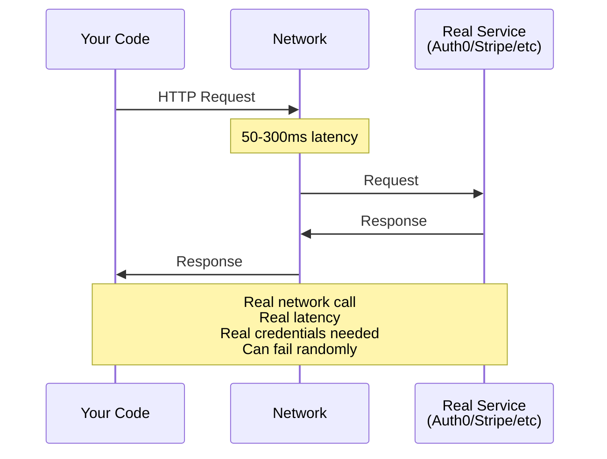
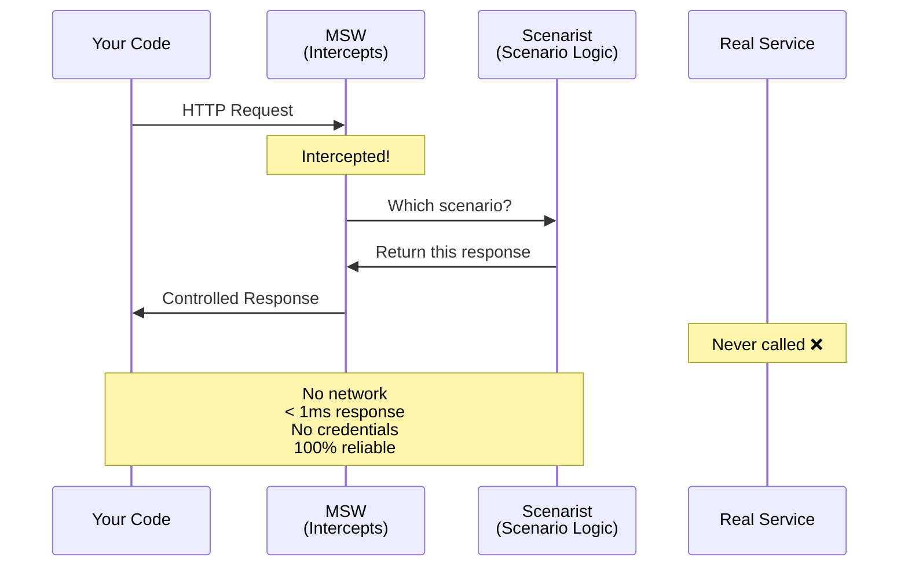
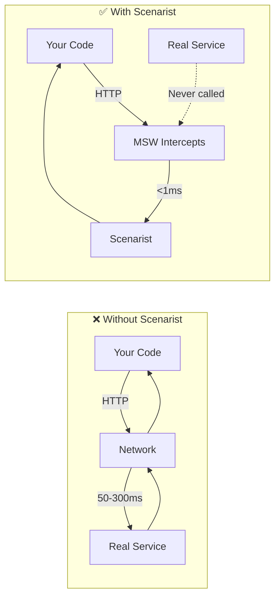

# How Scenarist Intercepts Requests

Shows the difference between real service calls and Scenarist-controlled responses.

**When to show:** Video 3, when explaining how Scenarist works

**What to say:**

> "Here's what normally happens. Your code makes an HTTP request, it goes over the network, hits the real service, comes back. With Scenarist, the request never leaves. MSW intercepts it at the network layer, Scenarist looks up the scenario, and returns a controlled response. The real service is never called. That's why it's fast. That's why it's reliable. That's why you don't need credentials."

## Without Scenarist



## With Scenarist



## Side-by-Side Comparison



## The Key Insight

```
┌─────────────────────────────────────────────────────────────────────────────┐
│                        THE INTERCEPTION POINT                               │
├─────────────────────────────────────────────────────────────────────────────┤
│                                                                             │
│   Your server code runs EXACTLY as it would in production.                 │
│   fetch(), axios, SDK calls - all work normally.                           │
│                                                                             │
│   But at the network layer, MSW intercepts.                                │
│   The request never leaves the process.                                    │
│   Scenarist decides the response.                                          │
│                                                                             │
│   This means:                                                               │
│   • Your code is tested (not mocked)                                       │
│   • External responses are controlled                                       │
│   • No network = no latency, no flakiness                                  │
│   • No credentials needed                                                   │
│   • Works offline                                                           │
│                                                                             │
└─────────────────────────────────────────────────────────────────────────────┘
```

## Visual Proof (for video)

Show terminal with json-server running, then run test:

```
Terminal 1: json-server
─────────────────────────
$ npx json-server db.json --port 3001
  Loading db.json
  Done

  Resources
  http://localhost:3001/inventory

  Home
  http://localhost:3001

  Watching...

  (no requests appear)  ← Point this out!
```

```
Terminal 2: Test with Scenarist
─────────────────────────────────
$ npm test

  ✓ premium user sees discount (23ms)
  ✓ out of stock shows error (18ms)
  ✓ sold out during checkout (21ms)

  All tests passed!
```

> "json-server is running. But look - zero requests. Scenarist intercepted everything."
