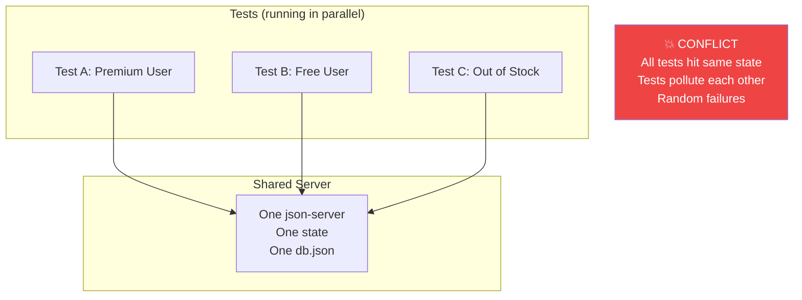
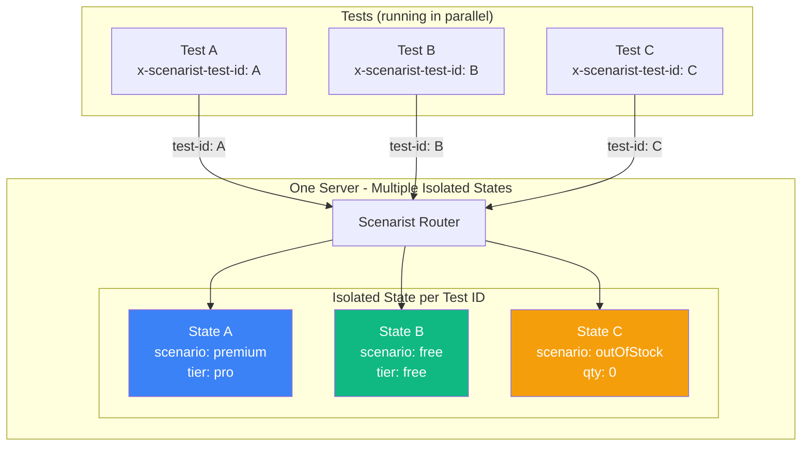

# Parallel Test Isolation

Shows how multiple tests run simultaneously with different scenarios, all isolated.

**When to show:** Video 3 (intro) and Video 10 (deep dive on parallel testing)

**What to say:**

> "Here's three tests running at the same time. Test A is testing a premium user. Test B is testing a free user. Test C is testing an out-of-stock scenario. Same server. Same endpoint. Different responses. Each test has its own isolated state."

## The Problem Without Scenarist



## With Scenarist



## How It Works

```
┌─────────────────────────────────────────────────────────────────────────────┐
│                         TEST ID ISOLATION                                   │
├─────────────────────────────────────────────────────────────────────────────┤
│                                                                             │
│  Every request includes a header:                                          │
│                                                                             │
│    x-scenarist-test-id: <unique-id>                                        │
│                                                                             │
│  Scenarist uses this to:                                                   │
│  1. Look up which scenario this test is using                              │
│  2. Maintain isolated state for this test                                  │
│  3. Return responses specific to this test                                 │
│                                                                             │
│  Result:                                                                    │
│  • 100 tests can run in parallel                                           │
│  • Each has its own scenario                                               │
│  • Each has its own state                                                  │
│  • Zero conflicts                                                          │
│                                                                             │
└─────────────────────────────────────────────────────────────────────────────┘
```

## The Numbers

```
Without Scenarist (sequential to avoid conflicts):
─────────────────────────────────────────────────
  50 tests × 2 seconds each = 100 seconds

With Scenarist (fully parallel):
─────────────────────────────────────────────────
  50 tests ÷ 10 workers = 5 batches × 0.5s = 2.5 seconds

  40x faster CI.
```

## Key Points

- Header-based routing: each request tagged with test ID
- One server instance serves all tests
- State is isolated per test ID
- No shared state = no conflicts = no flakiness
