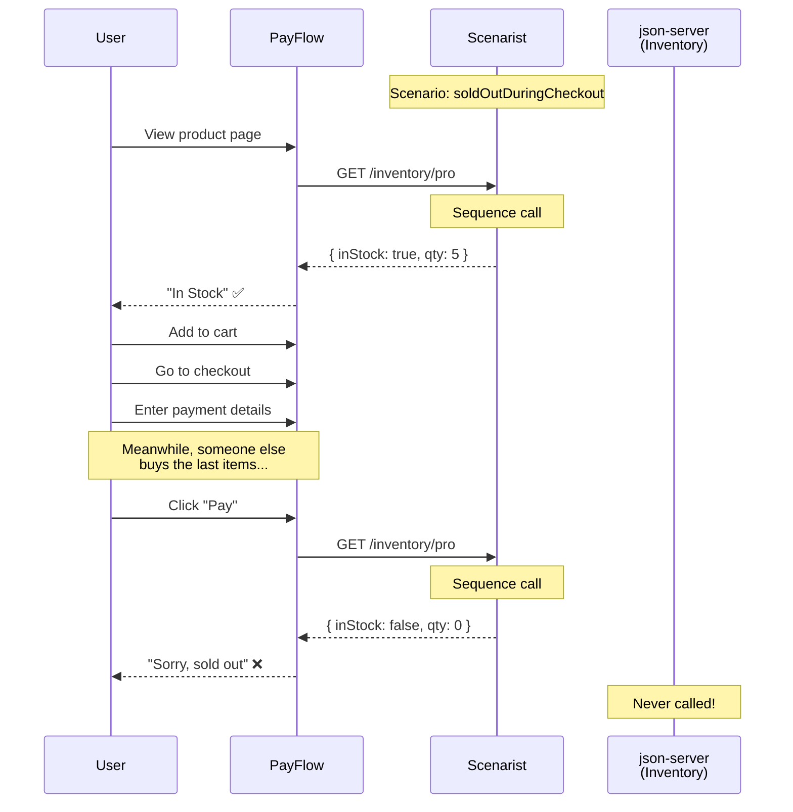

# Sequence: Sold Out During Checkout

The killer demo - showing how the same endpoint returns different responses based on call order.

**When to show:** Video 8 (Response Sequences) - this is the "aha" moment

**What to say:**

> "This is the scenario that's impossible to test with real services. User loads the page, stock shows 5 available. User adds to cart. User fills out payment. Meanwhile, someone else buys the last items. User clicks Pay. What happens?"
>
> "With Scenarist, we define a sequence. First call: in stock. Second call: out of stock. Same endpoint. Different response. Based on call order."

## The Sequence



## The Code

```typescript
// scenarios.ts
export const scenarios = {
  soldOutDuringCheckout: {
    "GET /api/inventory/:id": sequence([
      { status: 200, body: { inStock: true, quantity: 5 } }, // First call
      { status: 200, body: { inStock: false, quantity: 0 } }, // Second call
    ]),
  },
};
```

```typescript
// test
test("handles sold out during checkout", async ({ page, switchScenario }) => {
  await switchScenario("soldOutDuringCheckout");

  // First inventory call - shows in stock
  await page.goto("/products/pro");
  await expect(page.getByText("In Stock")).toBeVisible();

  // Add to cart, go to checkout
  await page.click("text=Add to Cart");
  await page.goto("/checkout");

  // Second inventory call - now out of stock
  await page.click("text=Pay");
  await expect(page.getByText("Sorry, sold out")).toBeVisible();
});
```

## Why This Is Impossible Without Scenarist

```
┌─────────────────────────────────────────────────────────────────────────────┐
│              HOW WOULD YOU TEST THIS WITH REAL SERVICES?                   │
├─────────────────────────────────────────────────────────────────────────────┤
│                                                                             │
│  Option 1: Edit db.json mid-test                                           │
│  ─────────────────────────────────                                          │
│  • Open db.json                                                             │
│  • Wait for user to reach checkout                                         │
│  • Quickly change quantity to 0                                            │
│  • Hope timing works out                                                   │
│  • Result: Flaky, manual, unrepeatable                                     │
│                                                                             │
│  Option 2: Actual race condition                                            │
│  ────────────────────────────────                                           │
│  • Run two browser sessions                                                │
│  • Have one buy everything                                                 │
│  • Hope the other hits checkout at the right moment                        │
│  • Result: Impossible to reliably reproduce                                │
│                                                                             │
│  Option 3: Mock at the wrong layer                                         │
│  ──────────────────────────────────                                         │
│  • Mock the inventory function directly                                    │
│  • Result: Not testing real code paths                                     │
│                                                                             │
│  With Scenarist: Define sequence. Run test. Done.                          │
│                                                                             │
└─────────────────────────────────────────────────────────────────────────────┘
```

## Key Points

- Sequences track call count per endpoint
- Each call advances to next response in sequence
- State resets between tests (isolated)
- This pattern also works for: polling, retries, state machines
