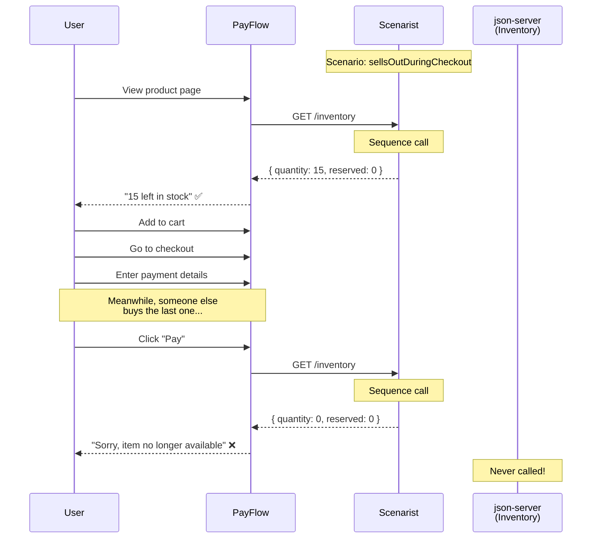

# Sequence: Sells Out During Checkout

The killer demo - showing how the same endpoint returns different responses based on call order.

**When to show:** Video 4 (Response Sequences) - this is the "aha" moment

**What to say:**

> "This is the scenario that's impossible to test with real services. User loads the page, sees 15 units in stock. User adds to cart. User fills out payment. Meanwhile, someone else buys the last one. User clicks Pay. What happens?"
>
> "With Scenarist, we define a sequence. First call: in stock. Second call: sold out. Same endpoint. Different response. Based on call order."

## The Sequence



## The Code

```typescript
// scenarios.ts
export const scenarios = {
  sellsOutDuringCheckout: {
    mocks: [
      {
        url: "http://localhost:3001/inventory",
        sequence: {
          responses: [
            // First call: in stock
            {
              status: 200,
              body: [
                { id: "1", productId: "1", quantity: 15, reserved: 0 },
                { id: "2", productId: "2", quantity: 15, reserved: 0 },
                { id: "3", productId: "3", quantity: 15, reserved: 0 },
              ],
            },
            // Second call: sold out
            {
              status: 200,
              body: [
                { id: "1", productId: "1", quantity: 0, reserved: 0 },
                { id: "2", productId: "2", quantity: 0, reserved: 0 },
                { id: "3", productId: "3", quantity: 0, reserved: 0 },
              ],
            },
          ],
          repeat: "last",
        },
      },
    ],
  },
};
```

```typescript
// test
test("handles item selling out during checkout", async ({
  page,
  switchScenario,
}) => {
  await switchScenario("sellsOutDuringCheckout");

  // First inventory call - shows items in stock
  await page.goto("/products");
  await expect(page.getByText("15 left in stock")).toBeVisible();

  // Add to cart, go to checkout
  await page.click("text=Add to Cart");
  await page.goto("/checkout");

  // Second inventory call - sold out
  await page.click("text=Pay");
  await expect(page.getByText("Item no longer available")).toBeVisible();
});
```

## Why This Is Impossible Without Scenarist

```
┌─────────────────────────────────────────────────────────────────────────────┐
│              HOW WOULD YOU TEST THIS WITH REAL SERVICES?                   │
├─────────────────────────────────────────────────────────────────────────────┤
│                                                                             │
│  Option 1: Edit db.json mid-test                                           │
│  ─────────────────────────────────                                          │
│  • Open db.json                                                             │
│  • Wait for user to reach checkout                                         │
│  • Quickly change quantity to 0                                            │
│  • Hope timing works out                                                   │
│  • Result: Flaky, manual, unrepeatable                                     │
│                                                                             │
│  Option 2: Actual race condition                                            │
│  ────────────────────────────────                                           │
│  • Run two browser sessions                                                │
│  • Have one buy all the stock                                              │
│  • Hope the other hits checkout at the right moment                        │
│  • Result: Impossible to reliably reproduce                                │
│                                                                             │
│  Option 3: Mock at the wrong layer                                         │
│  ──────────────────────────────────                                         │
│  • Mock the inventory function directly                                    │
│  • Result: Not testing real code paths                                     │
│                                                                             │
│  With Scenarist: Define sequence. Run test. Done.                          │
│                                                                             │
└─────────────────────────────────────────────────────────────────────────────┘
```

## Key Points

- Sequences track call count per endpoint
- Each call advances to next response in sequence
- State resets between tests (isolated)
- This pattern also works for: polling, retries, state machines
